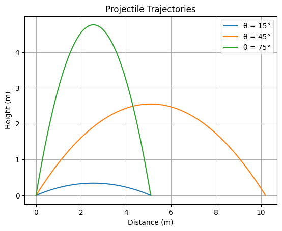
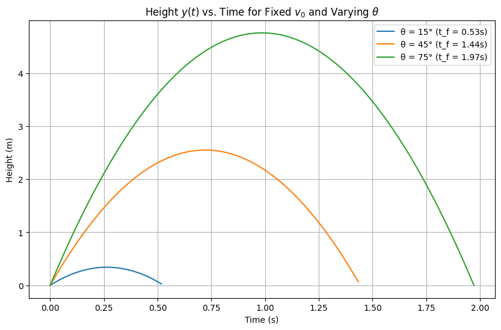
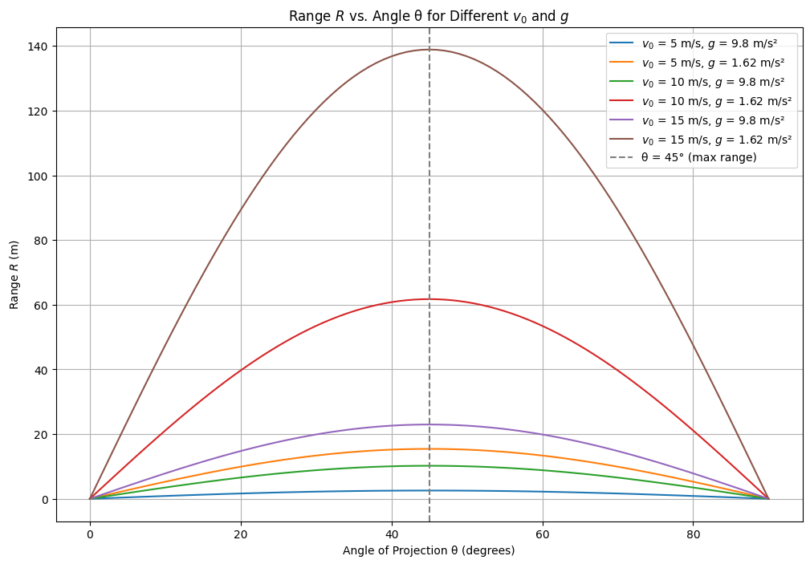
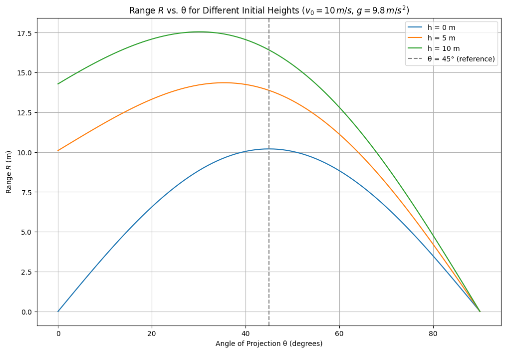
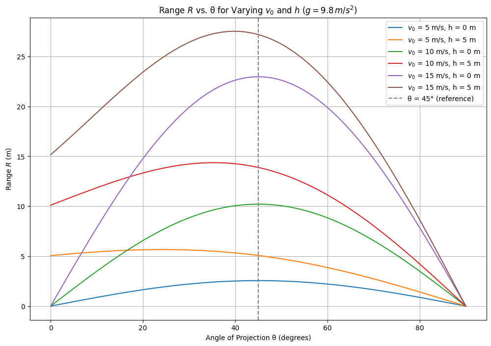
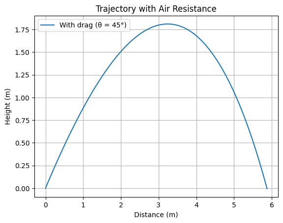

# Theoretical Foundation

## Derivation of Projectile Motion Equations from Fundamental Principles
- **Physical Basis**: Projectile motion is a classic example of two-dimensional kinematics under constant acceleration. We assume:
  - No air resistance (drag force = 0).
  - Gravity acts only vertically downward with constant $g = 9.8 \, \text{m/s}^2$.
  - Initial velocity $v_0$ is launched at angle $\theta$ from the horizontal.
- **Newton’s Second Law**:
  - Horizontal: No forces act, so acceleration is zero: $$a_x = \frac{d^2 x}{dt^2} = 0$$.
  - Vertical: Gravity provides constant acceleration: $$a_y = \frac{d^2 y}{dt^2} = -g$$.
- **Initial Conditions**:
  - At $t = 0$, position is $(x_0, y_0) = (0, 0)$ (assume launch from origin unless specified).
  - Velocity components:
    - Horizontal: $$v_{0x} = v_0 \cos(\theta)$$
    - Vertical: $$v_{0y} = v_0 \sin(\theta)$$
- **Equations of Motion**:
  - Horizontal (integrating $a_x = 0$): 
    $$\frac{dx}{dt} = v_0 \cos(\theta)$$
    $$x(t) = v_0 \cos(\theta) t$$
  - Vertical (integrating $a_y = -g$):
    $$\frac{dy}{dt} = v_0 \sin(\theta) - g t$$
    $$y(t) = v_0 \sin(\theta) t - \frac{1}{2} g t^2$$
- **Trajectory Equation**: Eliminate $t$ from $x(t)$ and $y(t)$:
  - From $x(t)$: $$t = \frac{x}{v_0 \cos(\theta)}$$
  - Substitute into $y(t)$:
    $$y = v_0 \sin(\theta) \cdot \frac{x}{v_0 \cos(\theta)} - \frac{1}{2} g \left(\frac{x}{v_0 \cos(\theta)}\right)^2$$
    $$y = x \tan(\theta) - \frac{g x^2}{2 v_0^2 \cos^2(\theta)}$$
  - This is a parabolic equation, showing the curved path of the projectile.

## Solution of Basic Differential Equations for Motion
- **Horizontal Motion**:
  - Start with: $$\frac{d^2 x}{dt^2} = 0$$
  - Integrate once: $$\frac{dx}{dt} = v_{0x} = v_0 \cos(\theta)$$ (constant velocity).
  - Integrate again: $$x(t) = v_0 \cos(\theta) t + x_0$$ (assume $x_0 = 0$).
- **Vertical Motion**:
  - Start with: $$\frac{d^2 y}{dt^2} = -g$$
  - Integrate once: $$\frac{dy}{dt} = v_{0y} - g t = v_0 \sin(\theta) - g t$$.
  - Integrate again: $$y(t) = v_0 \sin(\theta) t - \frac{1}{2} g t^2 + y_0$$ (assume $y_0 = 0$).
- **Time of Flight**:
  - Set $y(t) = 0$ to find when the projectile hits the ground:
    $$0 = v_0 \sin(\theta) t - \frac{1}{2} g t^2$$
    $$t (v_0 \sin(\theta) - \frac{1}{2} g t) = 0$$
    - Solutions: $t = 0$ (start) or $$t_f = \frac{2 v_0 \sin(\theta)}{g}$$ (end of flight).
- **Range Calculation**:
  - Substitute $t_f$ into $x(t)$:
    $$R = x(t_f) = v_0 \cos(\theta) \cdot \frac{2 v_0 \sin(\theta)}{g}$$
    - Use trigonometric identity $\sin(2\theta) = 2 \sin(\theta) \cos(\theta)$:
    $$R = \frac{v_0^2 \sin(2\theta)}{g}$$
- **Maximum Height**:
  - At peak, vertical velocity is zero: $$\frac{dy}{dt} = v_0 \sin(\theta) - g t = 0$$
  - Time to peak: $$t_{\text{peak}} = \frac{v_0 \sin(\theta)}{g}$$
  - Height: $$h_{\text{max}} = v_0 \sin(\theta) \cdot \frac{v_0 \sin(\theta)}{g} - \frac{1}{2} g \left(\frac{v_0 \sin(\theta)}{g}\right)^2 = \frac{v_0^2 \sin^2(\theta)}{2g}$$

## Description of the Family of Solutions Based on Initial Conditions
- **Key Parameters**:
  - **Initial Velocity ($v_0$)**: Range and height scale with $v_0^2$.
  - **Angle of Projection ($\theta$)**: Affects both direction and distance; $\sin(2\theta)$ peaks at $\theta = 45^\circ$.
  - **Gravitational Acceleration ($g$)**: Inversely proportional to range and height.
  - **Initial Height ($h$)**: If $y_0 = h \neq 0$, solve:
    $$0 = h + v_0 \sin(\theta) t - \frac{1}{2} g t^2$$
    - Quadratic in $t$: $$t = \frac{v_0 \sin(\theta) \pm \sqrt{(v_0 \sin(\theta))^2 + 2 g h}}{g}$$.
- **Behavior of Solutions**:
  - For $\theta < 45^\circ$: Shorter, flatter trajectories.
  - For $\theta = 45^\circ$: Maximum range when $h = 0$.
  - For $\theta > 45^\circ$: Higher but shorter trajectories.
  - Larger $v_0$ stretches the parabola; smaller $g$ (e.g., on the Moon, $g = 1.62 \, \text{m/s}^2$) increases range.
- **Energy Perspective**:
  - Initial kinetic energy: $$KE = \frac{1}{2} m v_0^2$$
  - At peak, vertical KE converts to potential energy: $$m g h_{\text{max}} = \frac{1}{2} m (v_0 \sin(\theta))^2$$.
- **Special Cases**:
  - $\theta = 0^\circ$: No vertical motion, $R = 0$.
  - $\theta = 90^\circ$: Vertical motion only, $R = 0$.

# Analysis of the Range

## Dependence of Horizontal Range on the Angle of Projection
- **Range Equation**: The horizontal range $R$ of a projectile launched from ground level ($h = 0$) is given by:
  $$R = \frac{v_0^2 \sin(2\theta)}{g}$$
  where:
  - $v_0$: Initial velocity (m/s).
  - $\theta$: Angle of projection (degrees or radians).
  - $g$: Gravitational acceleration (m/s²).
- **Behavior with $\theta$**:
  - The term $\sin(2\theta)$ determines how $R$ varies with $\theta$.
  - Range is zero at $\theta = 0^\circ$ and $\theta = 90^\circ$ because $\sin(0) = 0$ and $\sin(180^\circ) = 0$.
  - Maximum range occurs when $\sin(2\theta) = 1$, i.e., $2\theta = 90^\circ$, so:
    $$\theta = 45^\circ$$
    $$R_{\text{max}} = \frac{v_0^2}{g}$$
- **Symmetry**: 
  - $R$ is symmetric about $\theta = 45^\circ$. For example, $R$ at $\theta = 30^\circ$ equals $R$ at $\theta = 60^\circ$ since $\sin(60^\circ) = \sin(120^\circ)$.
- **Physical Insight**:
  - At low angles (e.g., $\theta = 15^\circ$), horizontal velocity is high, but time of flight is short.
  - At high angles (e.g., $\theta = 75^\circ$), time of flight is long, but horizontal velocity is low.
  - $\theta = 45^\circ$ balances these factors optimally for maximum range when $h = 0$.

## Influence of Parameters like Initial Velocity and Gravitational Acceleration
- **Initial Velocity ($v_0$)**:
  - $R$ depends on $v_0^2$, so doubling $v_0$ quadruples the range:
    $$R \propto v_0^2$$
  - Example: If $v_0 = 10 \, \text{m/s}$, $g = 9.8 \, \text{m/s}^2$, and $\theta = 45^\circ$:
    $$R = \frac{10^2}{9.8} \approx 10.2 \, \text{m}$$
    If $v_0 = 20 \, \text{m/s}$:
    $$R = \frac{20^2}{9.8} \approx 40.8 \, \text{m}$$
  - Physically, higher $v_0$ increases both horizontal distance and time aloft.

- **Gravitational Acceleration ($g$)**:
  - $R$ is inversely proportional to $g$:
    $$R \propto \frac{1}{g}$$
  - Example: For $v_0 = 10 \, \text{m/s}$, $\theta = 45^\circ$:
    - On Earth ($g = 9.8 \, \text{m/s}^2$): $$R \approx 10.2 \, \text{m}$$
    - On the Moon ($g = 1.62 \, \text{m/s}^2$): $$R = \frac{10^2}{1.62} \approx 61.7 \, \text{m}$$
  - Lower $g$ extends time of flight, significantly increasing $R$.

- **Combined Effects**:
  - The ratio $\frac{v_0^2}{g}$ governs the scale of $R$, while $\sin(2\theta)$ shapes its dependence on $\theta$.
  - For a fixed $\theta$, increasing $v_0$ or decreasing $g$ amplifies $R$, but the peak remains at $45^\circ$ unless launch height $h \neq 0$.

# Practical Applications

## Adaptation of the Model to Real-World Scenarios
- **Idealized Model Recap**: The basic range equation $$R = \frac{v_0^2 \sin(2\theta)}{g}$$ assumes:
  - Flat terrain (launch and landing at $y = 0$).
  - No air resistance.
  - Constant $g$.
- **Uneven Terrain**:
  - **Scenario**: Projectile launched from height $h$ lands at a different elevation $y_{\text{land}} \neq h$.
  - **Modified Equation**: Vertical displacement becomes $y(t) = h + v_0 \sin(\theta) t - \frac{1}{2} g t^2$. Set $y(t) = y_{\text{land}}$:
    $$y_{\text{land}} = h + v_0 \sin(\theta) t - \frac{1}{2} g t^2$$
    Solve for $t$:
    $$t = \frac{v_0 \sin(\theta) \pm \sqrt{(v_0 \sin(\theta))^2 - 2 g (h - y_{\text{land}})}}{g}$$
    Range: $$R = v_0 \cos(\theta) \cdot t$$ (use positive root).
  - **Impact**: Optimal $\theta$ shifts (e.g., < $45^\circ$ if landing is below launch point).
- **Air Resistance**:
  - **Effect**: Drag force $F_d = -k v$ (linear) or $F_d = -k v^2$ (quadratic) opposes motion, reducing $R$ and altering trajectory.
  - **Modified Dynamics**:
    - Horizontal: $$\frac{d^2 x}{dt^2} = -\frac{k}{m} \frac{dx}{dt}$$ (or $-\frac{k}{m} v_x^2$).
    - Vertical: $$\frac{d^2 y}{dt^2} = -g - \frac{k}{m} \frac{dy}{dt}$$.
  - **Solution**: Requires numerical methods (e.g., Euler or Runge-Kutta) as analytical solution is complex.
  - **Result**: $R$ decreases; optimal $\theta$ may shift depending on $v_0$ and drag coefficient $k$.
- **Visualization Suggestion**: Simulate trajectories with and without air resistance in Colab to compare $R$ and peak height.

## Examples from Sports, Engineering, or Astrophysics
- **Sports (Basketball)**:
  - **Scenario**: Shooting a basketball into a hoop (height $\approx 3 \, \text{m}$, distance $\approx 5-7 \, \text{m}$).
  - **Application**: Players adjust $\theta$ (typically $45^\circ$-$55^\circ$) and $v_0$ to account for arc and air drag.
  - **Model Adaptation**: Include $h_{\text{launch}} \approx 2 \, \text{m}$ (player height) and hoop height; optimal $\theta$ > $45^\circ$ due to target elevation.
- **Engineering (Artillery)**:
  - **Scenario**: Cannon firing a shell over uneven terrain with air resistance.
  - **Application**: Engineers use adjusted models:
    - Range with drag: Numerical simulation needed.
    - Terrain: $y_{\text{land}}$ varies (e.g., hill at 100 m).
  - **Real-World tweak**: Wind effects add horizontal acceleration, solved via vector addition to $v_0$.
- **Astrophysics (Rocket Launch)**:
  - **Scenario**: Rocket trajectory from Earth’s surface to orbit.
  - **Application**: Basic model applies early, but:
    - $g$ decreases with altitude: $$g(h) = \frac{G M}{(R_E + h)^2}$$ ($G$: gravitational constant, $M$: Earth mass, $R_E$: Earth radius).
    - Air resistance significant at low altitudes; diminishes in vacuum.
  - **Result**: Initial $\theta \approx 90^\circ$ (vertical), adjusting for orbital mechanics, far beyond simple projectile motion.

# Implementation

## Development of a Computational Tool or Algorithm for Simulation
- **Objective**: Create a Python-based tool to simulate projectile motion, accounting for varying initial conditions and optional real-world factors like air resistance.
- **Basic Algorithm (No Air Resistance)**:
  - **Inputs**: Initial velocity $v_0$, angle $\theta$, gravity $g$, initial height $h$.
  - **Equations**:
    - Time of flight: $$t_f = \frac{v_0 \sin(\theta) + \sqrt{(v_0 \sin(\theta))^2 + 2 g h}}{g}$$ (for $h \geq 0$).
    - Range: $$R = v_0 \cos(\theta) \cdot t_f$$.
    - Trajectory: $$y(x) = h + x \tan(\theta) - \frac{g x^2}{2 v_0^2 \cos^2(\theta)}$$.
  - **Steps**:
    1. Define parameters ($v_0$, $\theta$, $g$, $h$).
    2. Compute $t_f$ and $R$ analytically.
    3. Generate $x$ and $y$ points for plotting.
- **Advanced Algorithm (With Air Resistance)**:
  - **Model**: Add drag force, e.g., quadratic: $F_d = -k v^2$, where $v = \sqrt{v_x^2 + v_y^2}$.
  - **Differential Equations**:
    - Horizontal: $$\frac{d v_x}{dt} = -\frac{k}{m} v_x \sqrt{v_x^2 + v_y^2}$$.
    - Vertical: $$\frac{d v_y}{dt} = -g - \frac{k}{m} v_y \sqrt{v_x^2 + v_y^2}$$.
    - Position: $$\frac{dx}{dt} = v_x$$, $$\frac{dy}{dt} = v_y$$.
  - **Numerical Solution**: Use Euler method or Runge-Kutta (RK4) for accuracy.
  - **Steps**:
    1. Initialize $v_x = v_0 \cos(\theta)$, $v_y = v_0 \sin(\theta)$, $x = 0$, $y = h$.
    2. Iterate until $y < 0$, updating velocities and positions with small time steps $\Delta t$.

# Projectile Motion Analysis

## Introduction

This document provides an analytical and computational study of projectile motion under various conditions, including equations of motion, solutions for time of flight and range, and graphical plots. The objective is to explore how different parameters affect the range of the projectile.

## Core Equations

- **Horizontal Motion**:  
  The horizontal motion of the projectile is governed by:  
  $$x(t) = v_0 \cos(\theta) t$$  
  where:
  - \(v_0\) is the initial velocity,
  - \(\theta\) is the launch angle,
  - \(t\) is the time.

- **Vertical Motion**:  
  The vertical motion is described by the equation:  
  $$y(t) = h + v_0 \sin(\theta) t - \frac{1}{2} g t^2$$  
  where:
  - \(h\) is the initial height,
  - \(g\) is the gravitational acceleration.

- **Time of Flight**:  
  The time of flight is the time it takes for the projectile to return to the ground (where \(y(t) = 0\)):  
  $$0 = h + v_0 \sin(\theta) t - \frac{1}{2} g t^2$$  
  Solving this quadratic equation for \(t\), we get:  
  $$t_f = \frac{v_0 \sin(\theta) + \sqrt{(v_0 \sin(\theta))^2 + 2 g h}}{g}$$  
  (positive root only).

- **Range**:  
  The range of the projectile is given by:  
  $$R = v_0 \cos(\theta) \cdot t_f$$  
  For the case where \(h = 0\):  
  $$R = \frac{v_0^2 \sin(2\theta)}{g}$$

## Solutions

### Analytical Solution

In the ideal case (without drag or wind), we can compute the range \(R\) directly using the equations above. For \(h = 0\), the range maximizes at \(\theta = 45^\circ\).

### Numerical Solution

For real-world scenarios, we may need to include factors such as air resistance, which can be solved iteratively. This requires numerical methods such as Euler's method or Runge-Kutta.
