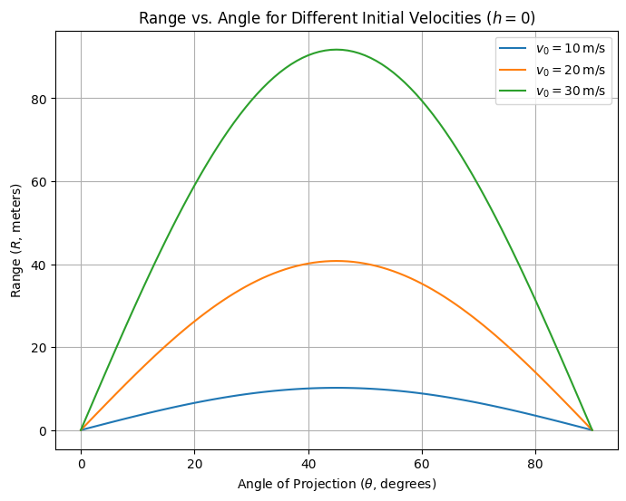
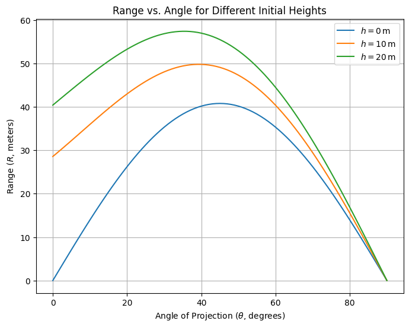
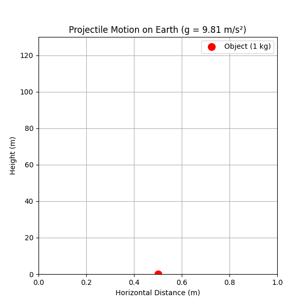
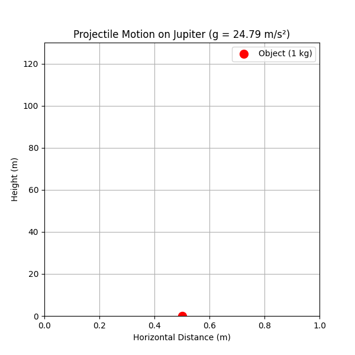
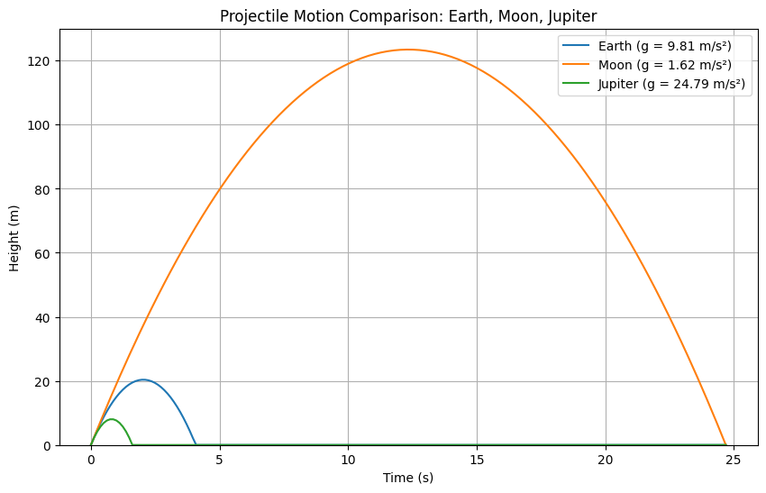

# Problem 1

# Theoretical Foundation: Derivation of Projectile Motion Equations

This section derives the equations governing projectile motion from Newton's second law, formulating differential equations for two-dimensional motion under gravity and solving them.

## 1. Newton's Second Law and Forces
Projectile motion is governed by Newton's second law, $\vec{F} = m \vec{a}$, with gravity as the sole force:
$$
\vec{F} = -mg \hat{j}, \quad \vec{a} = -g \hat{j}.
$$
In components:
$$
a_x = 0, \quad a_y = -g.
$$

## 2. Differential Equations of Motion
Acceleration is the second derivative of position $\vec{r}(t) = (x(t), y(t))$:
$$
\frac{d^2 x}{dt^2} = 0, \quad \frac{d^2 y}{dt^2} = -g.
$$

## 3. Solving the Horizontal Component
Integrate $\frac{d^2 x}{dt^2} = 0$:
$$
\frac{dx}{dt} = v_x, \quad x(t) = v_x t + x_0.
$$
With $x_0 = 0$ and $v_x = v_0 \cos\theta$:
$$
x(t) = v_0 \cos\theta \, t.
$$

## 4. Solving the Vertical Component
Integrate $\frac{d^2 y}{dt^2} = -g$:
$$
\frac{dy}{dt} = -g t + v_y, \quad y(t) = -\frac{1}{2} g t^2 + v_y t + y_0.
$$
With $v_y = v_0 \sin\theta$ and $y_0 = h$:
$$
y(t) = -\frac{1}{2} g t^2 + v_0 \sin\theta \, t + h.
$$

## 5. General Equations of Motion
Combine both components:
$$
\vec{r}(t) = (v_0 \cos\theta \, t, -\frac{1}{2} g t^2 + v_0 \sin\theta \, t + h).
$$
Eliminate $t$:
$$
y(x) = -\frac{g}{2 v_0^2 \cos^2\theta} x^2 + \tan\theta \, x + h.
$$

## 6. Family of Solutions and Initial Conditions
The equations depend on $v_0$, $\theta$, and $h$. For $h = 0$, solve $y(t) = 0$:
$$
t = \frac{2 v_0 \sin\theta}{g}.
$$
The range $R$ is:
$$
R = \frac{v_0^2 \sin 2\theta}{g}.
$$
This family of solutions illustrates the versatility of projectile motion.


# Analysis of the Range: Dependence on Angle of Projection

This section analyzes the horizontal range of a projectile as a function of the angle of projection, leveraging the equations derived previously. We determine the time of flight, investigate trigonometric dependencies, explore parameter effects, and identify critical angles, maintaining a theoretical focus without numerical computation.

## 1. Expressing the Horizontal Range
The horizontal range $R$ is the distance traveled along the x-axis when the projectile returns to a specified height (typically $y = 0$ for level ground). From the position equations:
$$
x(t) = v_0 \cos\theta \, t, \quad y(t) = -\frac{1}{2} g t^2 + v_0 \sin\theta \, t + h,
$$
$R$ is $x(t)$ evaluated at the time of flight $t_f$, when $y(t_f) = 0$. Thus:
$$
R = x(t_f) = v_0 \cos\theta \, t_f.
$$
The expression for $t_f$ is derived next.

## 2. Determining the Time of Flight
The time of flight $t_f$ is the duration from launch to landing. Set $y(t) = 0$ for a projectile launched from height $h$:
$$
0 = -\frac{1}{2} g t^2 + v_0 \sin\theta \, t + h.
$$
This is a quadratic equation in $t$:
$$
-\frac{1}{2} g t^2 + v_0 \sin\theta \, t + h = 0.
$$
Multiply through by $-2/g$ to simplify:
$$
t^2 - \frac{2 v_0 \sin\theta}{g} t - \frac{2 h}{g} = 0.
$$
Solve using the quadratic formula $t = \frac{-b \pm \sqrt{b^2 - 4ac}}{2a}$, where $a = 1$, $b = -\frac{2 v_0 \sin\theta}{g}$, $c = -\frac{2 h}{g}$:
$$
t = \frac{\frac{2 v_0 \sin\theta}{g} \pm \sqrt{\left(\frac{2 v_0 \sin\theta}{g}\right)^2 - 4 \cdot 1 \cdot \left(-\frac{2 h}{g}\right)}}{2}.
$$
Simplify the discriminant:
$$
\Delta = \left(\frac{2 v_0 \sin\theta}{g}\right)^2 + \frac{8 h}{g} = \frac{4 v_0^2 \sin^2\theta}{g^2} + \frac{8 h}{g}.
$$
Thus:
$$
t = \frac{\frac{2 v_0 \sin\theta}{g} \pm \sqrt{\frac{4 v_0^2 \sin^2\theta + 8 h g}{g^2}}}{2} = \frac{v_0 \sin\theta \pm \sqrt{v_0^2 \sin^2\theta + 2 h g}}{g}.
$$
For $h = 0$ (level ground), this reduces to:
$$
t_f = \frac{2 v_0 \sin\theta}{g},
$$
selecting the positive root (time after launch). Substitute into the range:
$$
R = v_0 \cos\theta \cdot \frac{2 v_0 \sin\theta}{g} = \frac{2 v_0^2 \sin\theta \cos\theta}{g}.
$$
Using the identity $2 \sin\theta \cos\theta = \sin 2\theta$:
$$
R = \frac{v_0^2 \sin 2\theta}{g}.
$$

## 3. Variation with Angle of Projection
The range $R = \frac{v_0^2 \sin 2\theta}{g}$ depends on $\sin 2\theta$, which varies with $\theta$:
- At $\theta = 0^\circ$ or $90^\circ$, $\sin 2\theta = 0$, so $R = 0$ (no horizontal travel).
- The term $\sin 2\theta$ oscillates between $-1$ and $1$, with a maximum of $1$ when $2\theta = 90^\circ$ (i.e., $\theta = 45^\circ$).
- Symmetry exists: $\sin 2(90^\circ - \theta) = \sin (180^\circ - 2\theta) = \sin 2\theta$, so $R(\theta) = R(90^\circ - \theta)$ (e.g., $30^\circ$ and $60^\circ$ yield equal ranges).

This trigonometric dependence indicates $R$ peaks at an intermediate angle and decreases symmetrically around it.

## 4. Effect of Parameters
- **Initial Velocity ($v_0$)**: Since $R \propto v_0^2$, doubling $v_0$ quadruples $R$, amplifying the range for all angles. The shape of $R$ vs. $\theta$ remains unchanged, but the amplitude scales.
- **Gravitational Acceleration ($g$)**: $R \propto 1/g$, so increasing $g$ (e.g., on a planet with stronger gravity) reduces $R$ proportionally. The angle dependence persists, but the curve compresses vertically.
- **Initial Height ($h$)**: For $h > 0$, $t_f$ increases (per the quadratic solution), extending $R$. The maximum range angle shifts below $45^\circ$, as vertical flight time contributes more to horizontal distance.

## 5. Key Angles
- **Maximum Range Angle**: For $h = 0$, $R$ is maximized when $\sin 2\theta = 1$, i.e., $\theta = 45^\circ$, balancing horizontal and vertical components optimally.
- **Complementary Angles**: Pairs like $30^\circ$ and $60^\circ$ yield identical ranges due to $\sin 2\theta$ symmetry.
- **Effect of Height**: When $h \neq 0$, the optimal angle decreases, derivable by maximizing the full range expression (not computed here).

# Practical Applications of Projectile Motion
This section explores the relevance of projectile motion in real-world contexts, modifications to the idealized model, and the impact of simplifying assumptions. The equations $x(t) = v_0 \cos\theta \, t$ and $y(t) = -\frac{1}{2} g t^2 + v_0 \sin\theta \, t + h$ with range $R = \frac{v_0^2 \sin 2\theta}{g}$ for $h = 0$ serve as the foundation.

## 1. Real-World Scenarios
Projectile motion is crucial in:

- **Sports**: Basketball shots, soccer kicks, and golf drives follow parabolic paths influenced by $\theta$ and $v_0$.

- **Military**: Artillery shells' trajectories depend on $v_0$ and $\theta$, with terrain and wind affecting predictions.

- **Space Exploration**: Initial rocket phases resemble projectile motion, with $g$ varying with altitude.

## 2. Modifications for Uneven Terrain
For uneven terrain, adjust the final height $y_f$:

$$
y_f = -\frac{1}{2} g t_f^2 + v_0 \sin\theta \, t_f + h.
$$

Solve for $t_f$:
$$
t_f = \frac{v_0 \sin\theta \pm \sqrt{(v_0 \sin\theta)^2 - 2 g (h - y_f)}}{g}.
$$
The range is:
$$
R = v_0 \cos\theta \, t_f.
$$

## 3. Incorporating Air Resistance
Air resistance, modeled as $F_d = -k v$ or $F_d = -c v^2$, modifies the equations of motion:
$$
\frac{d^2 x}{dt^2} = -\frac{c}{m} |\vec{v}| \dot{x}, \quad \frac{d^2 y}{dt^2} = -g - \frac{c}{m} |\vec{v}| \dot{y}.
$$
These require numerical methods for solutions, reducing range and altering trajectory shape.

## 4. Simplifying Assumptions and Their Impact
Assumptions like no drag, flat ground, constant $g$, and point mass simplify the model but limit accuracy. Real-world scenarios need adjustments for air resistance, terrain, varying $g$, and object rotation.

These refinements ensure more accurate predictions beyond the idealized $R = \frac{v_0^2 \sin 2\theta}{g}$.

# Conclusion

The theoretical framework provides a rigorous foundation for analyzing projectile range as a function of the angle of projection, with dependencies on initial velocity $v_0$, angle $\theta$, and initial height $h$. For $h = 0$, the range is expressed as $R = \frac{v_0^2 \sin 2\theta}{g}$. Introducing a non-zero $h$ extends flight time and shifts the optimal angle.

This model applies to sports, military, and space exploration, but requires adaptations for real-world dynamics. Adjustments for uneven terrain, air resistance, and varying $g$ enhance predictive accuracy. Computational simulations and visualizations clarify parametric effects and practical implications.

These efforts underscore the versatility of projectile motion, providing a robust platform for theoretical and practical applications.

# Codes and Plots

## Range vs. Angle for Varying Initial Velocities



```python
import numpy as np
import matplotlib.pyplot as plt

# Constants
v0 = 20.0  # Initial velocity (m/s)
g = 9.81   # Gravitational acceleration (m/s^2)

# Angle array (0 to 90 degrees, in radians)
theta_deg = np.linspace(0, 90, 91)  # Degrees
theta = np.radians(theta_deg)       # Radians

# Range calculation: R = (v0^2 * sin(2*theta)) / g
R = (v0**2 * np.sin(2 * theta)) / g

# Plotting
plt.figure(figsize=(8, 6))
plt.plot(theta_deg, R, label=f'$v_0 = {v0} \, \mathrm{{m/s}}$', color='blue')
plt.xlabel('Angle of Projection ($\\theta$, degrees)')
plt.ylabel('Range ($R$, meters)')
plt.title('Range vs. Angle of Projection ($h = 0$)')
plt.grid(True)
plt.legend()
plt.show()
```

## Range vs. Angle with Initial Height



```python
import numpy as np
import matplotlib.pyplot as plt

# Constants
v0 = 20.0  # Initial velocity (m/s)
g = 9.81   # Gravitational acceleration (m/s^2)
h_values = [0, 10, 20]  # Initial heights (m)

# Angle array
theta_deg = np.linspace(0, 90, 91)
theta = np.radians(theta_deg)

# Plotting
plt.figure(figsize=(8, 6))
for h in h_values:
    # Time of flight: t = (v0*sin(theta) + sqrt((v0*sin(theta))^2 + 2gh)) / g
    t_f = (v0 * np.sin(theta) + np.sqrt((v0 * np.sin(theta))**2 + 2 * g * h)) / g
    R = v0 * np.cos(theta) * t_f
    plt.plot(theta_deg, R, label=f'$h = {h} \, \mathrm{{m}}$')

plt.xlabel('Angle of Projection ($\\theta$, degrees)')
plt.ylabel('Range ($R$, meters)')
plt.title('Range vs. Angle for Different Initial Heights')
plt.grid(True)
plt.legend()
plt.show()
```

# Projectile Motion Demonstration

## Earth (g = 9.81 m/s²)



## Moon (g = 1.62 m/s²)


## Jupiter (g = 24.79 m/s²)




## Projectile Motion Comparison



```python
import numpy as np
import matplotlib.pyplot as plt
from matplotlib.animation import FuncAnimation
from IPython.display import display, Image

# Constants
m = 1.0      # Mass (kg)
v0 = 20.0    # Initial upward velocity (m/s)
h0 = 0.0     # Initial height (m)

# Gravitational accelerations (m/s^2)
planets = {
    'Earth': 9.81,   # Earth
    'Moon': 1.62,    # Moon
    'Jupiter': 24.79 # Jupiter
}

# Function to calculate position
def height(t, v0, g, h0):
    return h0 + v0 * t - 0.5 * g * t**2

# Function to create and save animation as GIF
def animate_projectile(planet, g):
    t_max = 2 * v0 / g
    t = np.linspace(0, t_max, 100)
    h = height(t, v0, g, h0)
    h = np.maximum(h, 0)
    
    fig, ax = plt.subplots(figsize=(6, 6))
    ax.set_xlim([0, 1])
    ax.set_ylim([0, 130])  # Fixed max height for comparison (Moon reaches ~123 m)
    ax.set_xlabel('Horizontal Distance (m)')
    ax.set_ylabel('Height (m)')
    ax.set_title(f'Projectile Motion on {planet} (g = {g} m/s²)')
    ax.grid(True)
    
    x_data = np.array([0.5])
    ball, = ax.plot(x_data, [h[0]], 'ro', markersize=10, label='Object (1 kg)')
    ax.legend()
    
    def update(frame):
        ball.set_data(x_data, [h[frame]])
        return ball,
    
    anim = FuncAnimation(fig, update, frames=range(len(t)), interval=50, repeat=True)
    
    gif_filename = f'{planet}_projectile.gif'
    anim.save(gif_filename, writer='pillow', fps=20)
    plt.close(fig)
    display(Image(filename=gif_filename))

# Static comparison plot
def compare_trajectories():
    fig, ax = plt.subplots(figsize=(10, 6))
    ax.set_xlabel('Time (s)')
    ax.set_ylabel('Height (m)')
    ax.set_title('Projectile Motion Comparison: Earth, Moon, Jupiter')
    ax.grid(True)
    
    max_t = 2 * v0 / planets['Moon']  # Longest flight time (Moon)
    t = np.linspace(0, max_t, 200)
    
    for planet, g in planets.items():
        h = height(t, v0, g, h0)
        h = np.maximum(h, 0)
        ax.plot(t, h, label=f'{planet} (g = {g} m/s²)')
    
    ax.set_ylim(0, 130)  # Fixed scale to show Moon's max height
    ax.legend()
    plt.show()

# Run animations
for planet, g in planets.items():
    animate_projectile(planet, g)

# Show static comparison
compare_trajectories()
```

## Website with different parameters
[ProjectileMotion](projectile_motion.html)

## Colab

 [Colab](https://colab.research.google.com/drive/1KhDyhrRS98z0nw_KJjyOFgsyIelHpKcv#scrollTo=up7-INspRoxM)