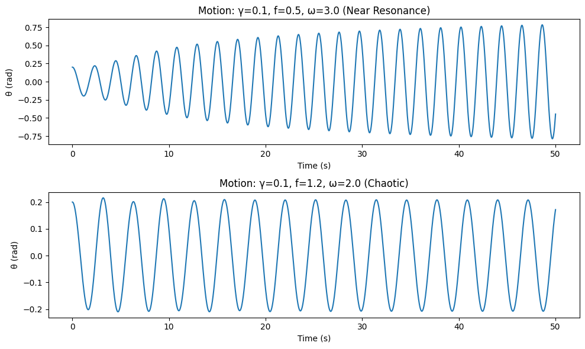
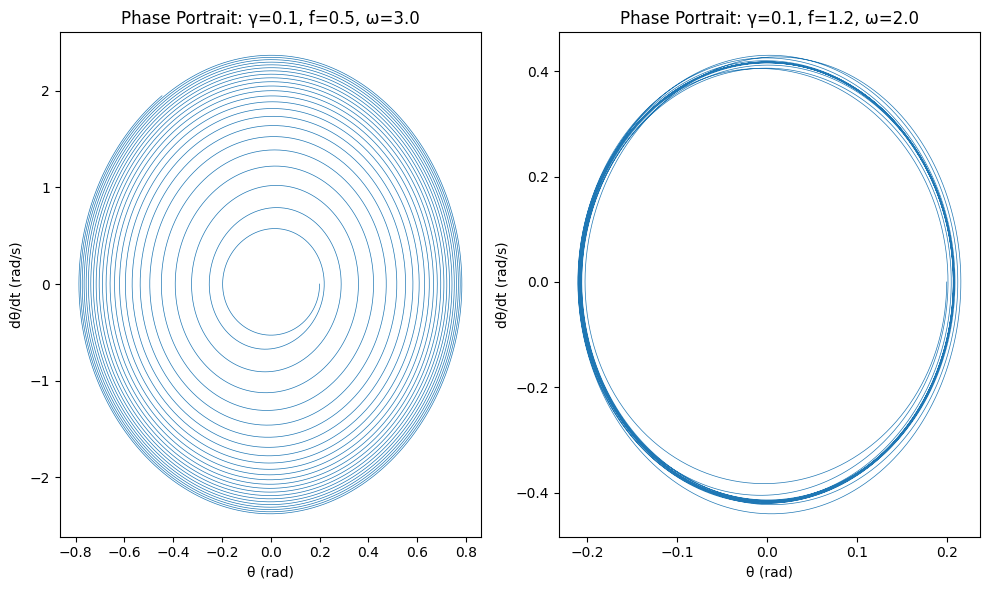
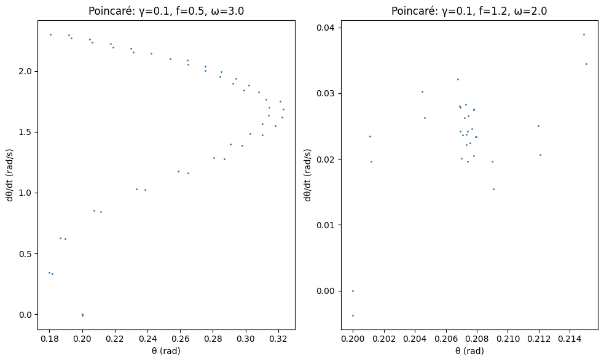
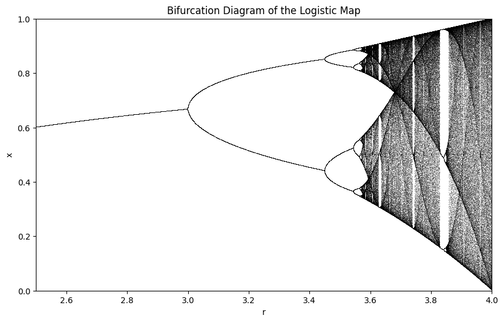

# Problem 2

# Theoretical Foundation of the Forced Damped Pendulum

The forced damped pendulum combines damping, gravitational forces, and external periodic forcing. This section derives the governing differential equation, approximates solutions for small-angle oscillations, and analyzes resonance conditions.

## 1. Governing Differential Equation

For a pendulum of length $l$ and mass $m$, with gravitational acceleration $g$, damping coefficient $b$, and external force amplitude $F_0$, the angular displacement $\theta(t)$ follows:

$$
\frac{d^2 \theta}{dt^2} + \frac{b}{m l} \frac{d\theta}{dt} + \frac{g}{l} \sin\theta = \frac{F_0}{m l} \cos(\omega t).
$$

Defining $\omega_0 = \sqrt{g/l}$ and $\gamma = b/(2m l)$, we get:

$$
\frac{d^2 \theta}{dt^2} + 2\gamma \frac{d\theta}{dt} + \omega_0^2 \sin\theta = f \cos(\omega t),
$$

where $f = F_0/(m l)$.

## 2. Small-Angle Approximation

For small angles, $\sin\theta \approx \theta$, simplifying to:

$$
\frac{d^2 \theta}{dt^2} + 2\gamma \frac{d\theta}{dt} + \omega_0^2 \theta = f \cos(\omega t).
$$

The general solution is:

$$
\theta(t) = e^{-\gamma t} (A \cos(\omega_d t) + B \sin(\omega_d t)) + R \cos(\omega t - \phi),
$$

with $\omega_d = \sqrt{\omega_0^2 - \gamma^2}$, $R = \frac{f}{\sqrt{(\omega_0^2 - \omega^2)^2 + (2\gamma \omega)^2}}$, and $\tan\phi = \frac{2\gamma \omega}{\omega_0^2 - \omega^2}$.

## 3. Resonance Conditions

Resonance occurs when $\omega \approx \omega_0$, maximizing $R$. For weak damping ($\gamma \ll \omega_0$), the resonant frequency is:

$$
\omega_r \approx \sqrt{\omega_0^2 - 2\gamma^2}.
$$

The quality factor $Q = \omega_0 / (2\gamma)$ indicates resonance sharpness. Nonlinear cases ($\sin\theta \neq \theta$) can lead to complex behaviors beyond small-angle approximations.

# Analysis of System Dynamics for the Forced Damped Pendulum

This section explores how damping, driving amplitude, and frequency affect the pendulum’s motion, transitioning from regular to chaotic behavior.

## 1. Influence of the Damping Coefficient

The damping coefficient $b$ introduces energy dissipation:

$$
\frac{d^2 \theta}{dt^2} + 2\gamma \frac{d\theta}{dt} + \omega_0^2 \sin\theta = f \cos(\omega t),
$$

where $\gamma = b/(2m l)$, $\omega_0 = \sqrt{g/l}$, and $f = F_0/(m l)$. For small angles:

$$
\theta_h(t) = e^{-\gamma t} (A \cos(\omega_d t) + B \sin(\omega_d t)),
$$

with $\omega_d = \sqrt{\omega_0^2 - \gamma^2}$. Higher $\gamma$ reduces the steady-state amplitude $R$:

$$
R = \frac{f}{\sqrt{(\omega_0^2 - \omega^2)^2 + (2\gamma \omega)^2}}.
$$

Increasing $b$ suppresses large oscillations and stabilizes the system.

## 2. Impact of Driving Amplitude

The driving amplitude $f$ determines energy input:

$$
R = \frac{f}{\sqrt{(\omega_0^2 - \omega^2)^2 + (2\gamma \omega)^2}}.
$$

For small $f$, the response is periodic. Large $f$ can lead to rotational or chaotic motion, overcoming the potential barrier at $\theta = \pi$.

## 3. Effect of Driving Frequency

The driving frequency $\omega$ affects the system’s response:

$$
R = \frac{f}{\sqrt{(\omega_0^2 - \omega^2)^2 + (2\gamma \omega)^2}}.
$$

Near resonance ($\omega \approx \omega_0$), amplitude peaks. For $\omega \ll \omega_0$, the response is adiabatic; for $\omega \gg \omega_0$, it diminishes. Varying $\omega$ can induce subharmonic or quasiperiodic motion.

## 4. Transition from Regular to Chaotic Motion

Regular motion forms predictable trajectories in phase space. Chaos emerges with aperiodic trajectories and sensitivity to initial conditions. The Lyapunov exponent $\lambda > 0$ indicates chaos:

$$
\frac{d^2 \theta}{dt^2} + \beta \frac{d\theta}{dt} + \sin\theta = A \cos(\omega t),
$$

where $\beta = 2\gamma/\omega_0$ and $A = f/\omega_0^2$. Chaos occurs for $A > A_c$ (e.g., $A_c \approx 1.1$ for $\beta = 0.5$, $\omega = 0.67\omega_0$).

## 5. Physical Interpretation of Regular vs. Chaotic Motion

Regular motion shows discrete peaks in the power spectrum, indicating predictable oscillations. Chaotic motion has a continuous spectrum, reflecting erratic swings and sensitivity to perturbations, common in complex systems.

# Practical Applications of the Forced Damped Pendulum Model

The forced damped pendulum serves as a fundamental model for oscillatory systems under external influence, with applications spanning engineering, physics, and technology. This section identifies key real-world examples—energy harvesting devices, suspension bridges, and oscillating circuits—and elucidates how insights from the model can be applied, leveraging its dynamics governed by:

$$
\frac{d^2 \theta}{dt^2} + 2\gamma \frac{d\theta}{dt} + \omega_0^2 \sin\theta = f \cos(\omega t),
$$

where $\gamma = b/(2m l)$, $\omega_0 = \sqrt{g/l}$, and $f = F_0/(m l)$ represent damping, natural frequency, and forcing amplitude, respectively.

## 1. Real-World Examples

### Energy Harvesting Devices
Energy harvesting devices convert ambient mechanical vibrations into electrical energy, often using piezoelectric or electromagnetic oscillators. These systems can be modeled as forced damped pendulums when subjected to periodic environmental forces (e.g., wind or machinery vibrations). The pendulum’s response, particularly near resonance, is critical:

$$
R = \frac{f}{\sqrt{(\omega_0^2 - \omega^2)^2 + (2\gamma \omega)^2}},
$$

where $R$ is the steady-state amplitude for small angles ($\sin\theta \approx \theta$). Devices like vibration-powered sensors exemplify this, with $\omega$ matching ambient frequencies.

### Suspension Bridges
Suspension bridges experience wind or traffic-induced oscillations, resembling a forced damped pendulum when cables or decks sway. The nonlinear term $\omega_0^2 \sin\theta$ captures large-amplitude effects, such as those observed in the Tacoma Narrows Bridge collapse. The equation’s forcing term $f \cos(\omega t)$ models periodic wind gusts, while damping $\gamma$ reflects structural energy dissipation.

### Oscillating Circuits
In electrical engineering, driven RLC circuits (resistor-inductor-capacitor) are analogous to the forced damped pendulum. The circuit’s differential equation:

$$
L \frac{d^2 q}{dt^2} + R \frac{dq}{dt} + \frac{1}{C} q = V_0 \cos(\omega t),
$$

mirrors the pendulum’s, with charge $q$ akin to $\theta$, inductance $L$ to mass, resistance $R$ to damping $b$, and capacitance $1/C$ to $\omega_0^2$. Applications include radio tuners and signal filters, where external voltage $V_0 \cos(\omega t)$ drives the system.

## 2. Application of Model Insights

### Energy Harvesting Devices
The model’s resonance behavior maximizes energy transfer when the driving frequency $\omega$ aligns with $\omega_0$, adjusted for damping:

$$
\omega_r \approx \sqrt{\omega_0^2 - 2\gamma^2}.
$$

Tuning $\omega_0$ (via pendulum length or mass) to match environmental frequencies enhances power output, calculated as $P = \frac{1}{2} b (\dot{\theta})^2$ in the mechanical domain, then converted electrically. Nonlinear effects ($\sin\theta$) inform designs for large-amplitude vibrations, preventing chaotic inefficiencies.

### Suspension Bridges
Insights into resonance and damping guide bridge design. Excessive amplitude at $\omega \approx \omega_0$ risks structural failure, as $R$ grows inversely with $\gamma$. Engineers increase $\gamma$ (e.g., via dampers) to reduce $Q = \omega_0/(2\gamma)$, the quality factor, mitigating oscillations. The nonlinear transition to chaos warns of unpredictable large swings under strong forcing $f$, prompting aerodynamic adjustments or cable reinforcements.

### Oscillating Circuits
The steady-state response $R$ and phase $\phi$:

$$
R = \frac{V_0 / L}{\sqrt{\left(\frac{1}{LC} - \omega^2\right)^2 + \left(\frac{R}{L} \omega\right)^2}}, \quad \tan\phi = \frac{R \omega}{\frac{1}{LC} - \omega^2},
$$

inform circuit tuning. Resonance at $\omega = 1/\sqrt{LC}$ amplifies signals in radios, while damping $R/L$ controls bandwidth. Nonlinear analogs (e.g., with varactors) leverage chaotic dynamics for secure communication or signal processing, drawing from the pendulum’s sensitivity to parameters.

# Conclusion

The forced damped pendulum encapsulates a rich spectrum of physical behaviors, bridging theoretical nonlinear dynamics with practical engineering applications. The governing equation:

$$
\frac{d^2 \theta}{dt^2} + 2\gamma \frac{d\theta}{dt} + \omega_0^2 \sin\theta = f \cos(\omega t),
$$

where $\gamma = b/(2m l)$, $\omega_0 = \sqrt{g/l}$, and $f = F_0/(m l)$, provides a foundation for understanding oscillatory systems under damping and external forcing. In the small-angle regime ($\sin\theta \approx \theta$), the solution:

## Website with pendulum simulations
[Pendulum Simulator](pendulum.html)

$$
\theta(t) = e^{-\gamma t} (A \cos(\omega_d t) + B \sin(\omega_d t)) + R \cos(\omega t - \phi),
$$

with $R = \frac{f}{\sqrt{(\omega_0^2 - \omega^2)^2 + (2\gamma \omega)^2}}$, reveals resonance near $\omega_r \approx \sqrt{\omega_0^2 - 2\gamma^2}$, offering predictable energy amplification critical for applications like energy harvesting and circuit tuning.

Analysis of system dynamics highlights the roles of damping $\gamma$, driving amplitude $f$, and frequency $\omega$. Higher $\gamma$ stabilizes motion by reducing $R$, while large $f$ and specific $\omega/\omega_0$ ratios can trigger transitions from regular, periodic trajectories to chaotic, aperiodic ones, marked by a positive Lyapunov exponent $\lambda > 0$. This duality—regular motion’s predictability versus chaos’s sensitivity—underscores the system’s complexity.

Practically, the model informs energy harvesting by optimizing $\omega_0$ for resonance, enhances suspension bridge stability by tuning $\gamma$ to mitigate $Q = \omega_0/(2\gamma)$, and guides oscillating circuits via analogies to RLC dynamics, where $R = \frac{V_0 / L}{\sqrt{\left(\frac{1}{LC} - \omega^2\right)^2 + \left(\frac{R}{L} \omega\right)^2}}$. Nonlinear insights further address large-amplitude effects and chaotic potential, from preventing bridge collapse to enabling advanced signal processing.

In sum, the forced damped pendulum exemplifies how fundamental physics principles—linear resonance, nonlinear transitions, and parameter interplay—translate into real-world solutions, advancing both theoretical understanding and technological innovation.

## Basic Simulation and Motion Plot



```python
import numpy as np
import matplotlib.pyplot as plt
from scipy.integrate import odeint

# Define the pendulum ODE
def pendulum_deriv(state, t, gamma, omega0_sq, f, omega):
    theta, theta_dot = state
    dtheta_dt = theta_dot
    dtheta_dot_dt = -2 * gamma * theta_dot - omega0_sq * np.sin(theta) + f * np.cos(omega * t)
    return [dtheta_dt, dtheta_dot_dt]

# Parameters
g = 9.81  # gravitational acceleration (m/s^2)
l = 1.0   # pendulum length (m)
omega0_sq = g / l  # natural frequency squared
t = np.linspace(0, 50, 10000)  # time array

# Simulation function
def simulate_pendulum(gamma, f, omega, theta0=0.2, theta_dot0=0.0):
    state0 = [theta0, theta_dot0]
    sol = odeint(pendulum_deriv, state0, t, args=(gamma, omega0_sq, f, omega))
    return sol[:, 0], sol[:, 1]  # theta, theta_dot

# Example cases
plt.figure(figsize=(10, 6))

# Case 1: Low damping, near resonance
theta1, theta_dot1 = simulate_pendulum(gamma=0.1, f=0.5, omega=3.0)
plt.subplot(2, 1, 1)
plt.plot(t, theta1)
plt.title("Motion: γ=0.1, f=0.5, ω=3.0 (Near Resonance)")
plt.xlabel("Time (s)")
plt.ylabel("θ (rad)")

# Case 2: High amplitude, chaotic
theta2, theta_dot2 = simulate_pendulum(gamma=0.1, f=1.2, omega=2.0)
plt.subplot(2, 1, 2)
plt.plot(t, theta2)
plt.title("Motion: γ=0.1, f=1.2, ω=2.0 (Chaotic)")
plt.xlabel("Time (s)")
plt.ylabel("θ (rad)")

plt.tight_layout()
plt.show()
```

## Phase Portrait Generation



```python
import numpy as np
import matplotlib.pyplot as plt
from scipy.integrate import odeint

# Define the pendulum ODE
def pendulum_deriv(state, t, gamma, omega0_sq, f, omega):
    theta, theta_dot = state
    dtheta_dt = theta_dot
    dtheta_dot_dt = -2 * gamma * theta_dot - omega0_sq * np.sin(theta) + f * np.cos(omega * t)
    return [dtheta_dt, dtheta_dot_dt]

# Parameters
g = 9.81
l = 1.0
omega0_sq = g / l
t = np.linspace(0, 50, 10000)

# Simulation function
def simulate_pendulum(gamma, f, omega, theta0=0.2, theta_dot0=0.0):
    state0 = [theta0, theta_dot0]
    sol = odeint(pendulum_deriv, state0, t, args=(gamma, omega0_sq, f, omega))
    return sol[:, 0], sol[:, 1]

# Plot phase portraits
plt.figure(figsize=(10, 6))

# Case 1: Low damping, near resonance
theta1, theta_dot1 = simulate_pendulum(gamma=0.1, f=0.5, omega=3.0)
plt.subplot(1, 2, 1)
plt.plot(theta1, theta_dot1, lw=0.5)
plt.title("Phase Portrait: γ=0.1, f=0.5, ω=3.0")
plt.xlabel("θ (rad)")
plt.ylabel("dθ/dt (rad/s)")

# Case 2: High amplitude, chaotic
theta2, theta_dot2 = simulate_pendulum(gamma=0.1, f=1.2, omega=2.0)
plt.subplot(1, 2, 2)
plt.plot(theta2, theta_dot2, lw=0.5)
plt.title("Phase Portrait: γ=0.1, f=1.2, ω=2.0")
plt.xlabel("θ (rad)")
plt.ylabel("dθ/dt (rad/s)")

plt.tight_layout()
plt.show()
```

## Poincaré Section Generation



```python
import numpy as np
import matplotlib.pyplot as plt
from scipy.integrate import odeint

# Define the pendulum ODE
def pendulum_deriv(state, t, gamma, omega0_sq, f, omega):
    theta, theta_dot = state
    dtheta_dt = theta_dot
    dtheta_dot_dt = -2 * gamma * theta_dot - omega0_sq * np.sin(theta) + f * np.cos(omega * t)
    return [dtheta_dt, dtheta_dot_dt]

# Parameters
g = 9.81
l = 1.0
omega0_sq = g / l
t = np.linspace(0, 50, 10000)

# Simulation function
def simulate_pendulum(gamma, f, omega, theta0=0.2, theta_dot0=0.0):
    state0 = [theta0, theta_dot0]
    sol = odeint(pendulum_deriv, state0, t, args=(gamma, omega0_sq, f, omega))
    return sol[:, 0], sol[:, 1]

# Poincaré section function
def poincare_section(theta, theta_dot, t, omega):
    period = 2 * np.pi / omega
    indices = np.where(np.abs(t % period) < 0.01)[0]
    return theta[indices], theta_dot[indices]

# Plot Poincaré sections
plt.figure(figsize=(10, 6))

# Case 1: Low damping, near resonance
theta1, theta_dot1 = simulate_pendulum(gamma=0.1, f=0.5, omega=3.0)
p_theta1, p_theta_dot1 = poincare_section(theta1, theta_dot1, t, 3.0)
plt.subplot(1, 2, 1)
plt.scatter(p_theta1, p_theta_dot1, s=1)
plt.title("Poincaré: γ=0.1, f=0.5, ω=3.0")
plt.xlabel("θ (rad)")
plt.ylabel("dθ/dt (rad/s)")

# Case 2: High amplitude, chaotic
theta2, theta_dot2 = simulate_pendulum(gamma=0.1, f=1.2, omega=2.0)
p_theta2, p_theta_dot2 = poincare_section(theta2, theta_dot2, t, 2.0)
plt.subplot(1, 2, 2)
plt.scatter(p_theta2, p_theta_dot2, s=1)
plt.title("Poincaré: γ=0.1, f=1.2, ω=2.0")
plt.xlabel("θ (rad)")
plt.ylabel("dθ/dt (rad/s)")

plt.tight_layout()
plt.show()
```

## Bifurcation Diagram Generation



```python
import numpy as np
import matplotlib.pyplot as plt

def logistic_map(r, x):
    return r * x * (1 - x)

def bifurcation_diagram(r_min=2.5, r_max=4.0, num_r=10000, num_iter=1000, num_last=100):
    r_values = np.linspace(r_min, r_max, num_r)
    x = 0.5 * np.ones(num_r)
    
    plt.figure(figsize=(10, 6), dpi=100)
    
    for _ in range(num_iter):
        x = logistic_map(r_values, x)
        if _ >= (num_iter - num_last):
            plt.plot(r_values, x, ',k', alpha=0.25)
    
    plt.xlim(r_min, r_max)
    plt.ylim(0, 1)
    plt.xlabel("r")
    plt.ylabel("x")
    plt.title("Bifurcation Diagram of the Logistic Map")
    plt.show()

# Run the bifurcation diagram function
bifurcation_diagram()
```


## Colab

 [Colab](https://colab.research.google.com/drive/1g4xaVK18GBao3cgol9j-AK7Odhc4l3yK#scrollTo=khxGamTXf-kp)