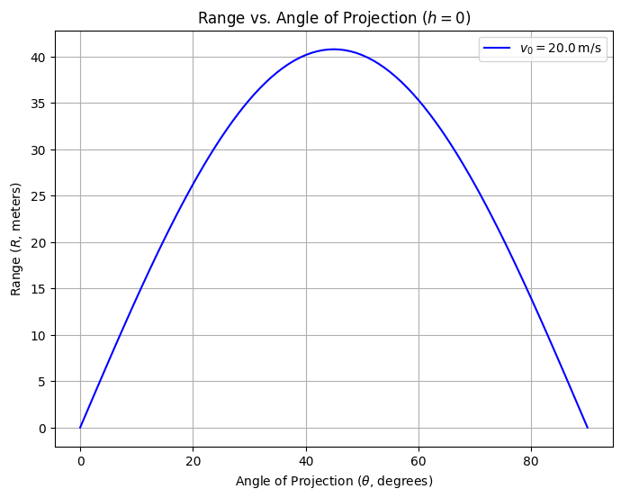

# Theoretical Foundation: Derivation of Projectile Motion Equations

This section establishes the theoretical underpinnings of projectile motion by deriving the governing equations from fundamental physical principles. We begin with Newton's second law, formulate differential equations for two-dimensional motion under gravity, solve these equations, and explore the resulting family of solutions parameterized by initial conditions.

## 1. Newton's Second Law and Forces
Projectile motion describes the trajectory of an object under the sole influence of gravity, neglecting air resistance. Newton's second law, $\vec{F} = m \vec{a}$, governs the dynamics, where $\vec{F}$ is the net force, $m$ is the mass, and $\vec{a}$ is the acceleration.

The only force acting is gravity, directed downward:
$$
\vec{F} = -mg \hat{j},
$$
where $g$ is the gravitational acceleration (typically $9.81 \, \text{m/s}^2$), and $\hat{j}$ is the unit vector in the vertical (y) direction. Thus:
$$
m \vec{a} = -mg \hat{j}.
$$
Dividing through by mass $m$:
$$
\vec{a} = -g \hat{j}.
$$
In component form, with $\vec{a} = (a_x, a_y)$:
$$
a_x = 0, \quad a_y = -g.
$$

## 2. Differential Equations of Motion
Acceleration is the second derivative of position with respect to time. Define the position vector $\vec{r}(t) = (x(t), y(t))$, so:
$$
\vec{a} = \frac{d^2 \vec{r}}{dt^2} = \left( \frac{d^2 x}{dt^2}, \frac{d^2 y}{dt^2} \right).
$$
From the acceleration components:
- Horizontal: $\frac{d^2 x}{dt^2} = 0$,
- Vertical: $\frac{d^2 y}{dt^2} = -g$.

These are second-order ordinary differential equations (ODEs). To solve them, integrate with respect to time, incorporating initial conditions.

## 3. Solving the Horizontal Component
For the x-direction:
$$
\frac{d^2 x}{dt^2} = 0.
$$
Integrate once:
$$
\frac{dx}{dt} = v_x,
$$
where $v_x$ is the constant horizontal velocity. Integrate again:
$$
x(t) = v_x t + x_0,
$$
where $x_0$ is the initial x-position. Assume launch from the origin ($x_0 = 0$) unless specified otherwise:
$$
x(t) = v_x t.
$$
The initial velocity $v_0$ at angle $\theta$ has components:
$$
v_x = v_0 \cos\theta.
$$
Thus:
$$
x(t) = v_0 \cos\theta \, t.
$$

## 4. Solving the Vertical Component
For the y-direction:
$$
\frac{d^2 y}{dt^2} = -g.
$$
Integrate once:
$$
\frac{dy}{dt} = -g t + v_y,
$$
where $v_y$ is the initial vertical velocity. Integrate again:
$$
y(t) = -\frac{1}{2} g t^2 + v_y t + y_0,
$$
where $y_0$ is the initial height. With $v_y = v_0 \sin\theta$ and assuming $y_0 = h$ (launch height):
$$
y(t) = -\frac{1}{2} g t^2 + v_0 \sin\theta \, t + h.
$$

## 5. General Equations of Motion
Combining both components, the position as a function of time is:
$$
\vec{r}(t) = (x(t), y(t)) = (v_0 \cos\theta \, t, -\frac{1}{2} g t^2 + v_0 \sin\theta \, t + h).
$$
This parametric form describes the projectile's trajectory. To eliminate time and obtain the path equation, solve $x(t) = v_0 \cos\theta \, t$ for $t$:
$$
t = \frac{x}{v_0 \cos\theta}.
$$
Substitute into $y(t)$:
$$
y(x) = -\frac{1}{2} g \left( \frac{x}{v_0 \cos\theta} \right)^2 + v_0 \sin\theta \left( \frac{x}{v_0 \cos\theta} \right) + h.
$$
Simplify:
$$
y(x) = -\frac{g}{2 v_0^2 \cos^2\theta} x^2 + \tan\theta \, x + h.
$$
This is a quadratic equation in $x$, confirming the parabolic nature of the trajectory.

## 6. Family of Solutions and Initial Conditions
The equations depend on initial conditions: $v_0$ (initial speed), $\theta$ (launch angle), and $h$ (initial height). Variations in these parameters generate a family of solutions:
- **Initial Speed ($v_0$)**: Scales the range and height quadratically, as kinetic energy $\frac{1}{2} m v_0^2$ influences flight time.
- **Launch Angle ($\theta$)**: Adjusts the balance between horizontal and vertical components, affecting range and maximum height.
- **Initial Height ($h$)**: Shifts the vertical intercept, altering the time to reach the ground.

For $h = 0$, the time of flight is found by setting $y(t) = 0$:
$$
0 = -\frac{1}{2} g t^2 + v_0 \sin\theta \, t,
$$
$$
t (-\frac{1}{2} g t + v_0 \sin\theta) = 0.
$$
Solutions are $t = 0$ (launch) and:
$$
t = \frac{2 v_0 \sin\theta}{g}.
$$
The range $R$ is then:
$$
R = x\left( \frac{2 v_0 \sin\theta}{g} \right) = v_0 \cos\theta \cdot \frac{2 v_0 \sin\theta}{g} = \frac{v_0^2 \sin 2\theta}{g}.
$$
This family of solutions highlights the versatility of projectile motion across different scenarios.

## Conclusion
The derived equations provide a rigorous foundation for analyzing projectile range as a function of angle, with dependencies on $v_0$, $\theta$, and $h$ clearly delineated. Subsequent sections will explore these relationships further.

# Analysis of the Range: Dependence on Angle of Projection

This section analyzes the horizontal range of a projectile as a function of the angle of projection, leveraging the equations derived previously. We determine the time of flight, investigate trigonometric dependencies, explore parameter effects, and identify critical angles, maintaining a theoretical focus without numerical computation.

## 1. Expressing the Horizontal Range
The horizontal range $R$ is the distance traveled along the x-axis when the projectile returns to a specified height (typically $y = 0$ for level ground). From the position equations:
$$
x(t) = v_0 \cos\theta \, t, \quad y(t) = -\frac{1}{2} g t^2 + v_0 \sin\theta \, t + h,
$$
$R$ is $x(t)$ evaluated at the time of flight $t_f$, when $y(t_f) = 0$. Thus:
$$
R = x(t_f) = v_0 \cos\theta \, t_f.
$$
The expression for $t_f$ is derived next.

## 2. Determining the Time of Flight
The time of flight $t_f$ is the duration from launch to landing. Set $y(t) = 0$ for a projectile launched from height $h$:
$$
0 = -\frac{1}{2} g t^2 + v_0 \sin\theta \, t + h.
$$
This is a quadratic equation in $t$:
$$
-\frac{1}{2} g t^2 + v_0 \sin\theta \, t + h = 0.
$$
Multiply through by $-2/g$ to simplify:
$$
t^2 - \frac{2 v_0 \sin\theta}{g} t - \frac{2 h}{g} = 0.
$$
Solve using the quadratic formula $t = \frac{-b \pm \sqrt{b^2 - 4ac}}{2a}$, where $a = 1$, $b = -\frac{2 v_0 \sin\theta}{g}$, $c = -\frac{2 h}{g}$:
$$
t = \frac{\frac{2 v_0 \sin\theta}{g} \pm \sqrt{\left(\frac{2 v_0 \sin\theta}{g}\right)^2 - 4 \cdot 1 \cdot \left(-\frac{2 h}{g}\right)}}{2}.
$$
Simplify the discriminant:
$$
\Delta = \left(\frac{2 v_0 \sin\theta}{g}\right)^2 + \frac{8 h}{g} = \frac{4 v_0^2 \sin^2\theta}{g^2} + \frac{8 h}{g}.
$$
Thus:
$$
t = \frac{\frac{2 v_0 \sin\theta}{g} \pm \sqrt{\frac{4 v_0^2 \sin^2\theta + 8 h g}{g^2}}}{2} = \frac{v_0 \sin\theta \pm \sqrt{v_0^2 \sin^2\theta + 2 h g}}{g}.
$$
For $h = 0$ (level ground), this reduces to:
$$
t_f = \frac{2 v_0 \sin\theta}{g},
$$
selecting the positive root (time after launch). Substitute into the range:
$$
R = v_0 \cos\theta \cdot \frac{2 v_0 \sin\theta}{g} = \frac{2 v_0^2 \sin\theta \cos\theta}{g}.
$$
Using the identity $2 \sin\theta \cos\theta = \sin 2\theta$:
$$
R = \frac{v_0^2 \sin 2\theta}{g}.
$$

## 3. Variation with Angle of Projection
The range $R = \frac{v_0^2 \sin 2\theta}{g}$ depends on $\sin 2\theta$, which varies with $\theta$:
- At $\theta = 0^\circ$ or $90^\circ$, $\sin 2\theta = 0$, so $R = 0$ (no horizontal travel).
- The term $\sin 2\theta$ oscillates between $-1$ and $1$, with a maximum of $1$ when $2\theta = 90^\circ$ (i.e., $\theta = 45^\circ$).
- Symmetry exists: $\sin 2(90^\circ - \theta) = \sin (180^\circ - 2\theta) = \sin 2\theta$, so $R(\theta) = R(90^\circ - \theta)$ (e.g., $30^\circ$ and $60^\circ$ yield equal ranges).

This trigonometric dependence indicates $R$ peaks at an intermediate angle and decreases symmetrically around it.

## 4. Effect of Parameters
- **Initial Velocity ($v_0$)**: Since $R \propto v_0^2$, doubling $v_0$ quadruples $R$, amplifying the range for all angles. The shape of $R$ vs. $\theta$ remains unchanged, but the amplitude scales.
- **Gravitational Acceleration ($g$)**: $R \propto 1/g$, so increasing $g$ (e.g., on a planet with stronger gravity) reduces $R$ proportionally. The angle dependence persists, but the curve compresses vertically.
- **Initial Height ($h$)**: For $h > 0$, $t_f$ increases (per the quadratic solution), extending $R$. The maximum range angle shifts below $45^\circ$, as vertical flight time contributes more to horizontal distance.

## 5. Key Angles
- **Maximum Range Angle**: For $h = 0$, $R$ is maximized when $\sin 2\theta = 1$, i.e., $\theta = 45^\circ$, balancing horizontal and vertical components optimally.
- **Complementary Angles**: Pairs like $30^\circ$ and $60^\circ$ yield identical ranges due to $\sin 2\theta$ symmetry.
- **Effect of Height**: When $h \neq 0$, the optimal angle decreases, derivable by maximizing the full range expression (not computed here).

## Conclusion
The range $R = \frac{v_0^2 \sin 2\theta}{g}$ (for $h = 0$) encapsulates the angle dependence, modulated by $v_0$ and $g$. Non-zero $h$ complicates the expression, enriching the analysis. These relationships underpin subsequent simulations and applications.

# Codes and Plots



```python
import numpy as np
import matplotlib.pyplot as plt

# Constants
v0 = 20.0  # Initial velocity (m/s)
g = 9.81   # Gravitational acceleration (m/s^2)

# Angle array (0 to 90 degrees, in radians)
theta_deg = np.linspace(0, 90, 91)  # Degrees
theta = np.radians(theta_deg)       # Radians

# Range calculation: R = (v0^2 * sin(2*theta)) / g
R = (v0**2 * np.sin(2 * theta)) / g

# Plotting
plt.figure(figsize=(8, 6))
plt.plot(theta_deg, R, label=f'$v_0 = {v0} \, \mathrm{{m/s}}$', color='blue')
plt.xlabel('Angle of Projection ($\\theta$, degrees)')
plt.ylabel('Range ($R$, meters)')
plt.title('Range vs. Angle of Projection ($h = 0$)')
plt.grid(True)
plt.legend()
plt.show()
```

