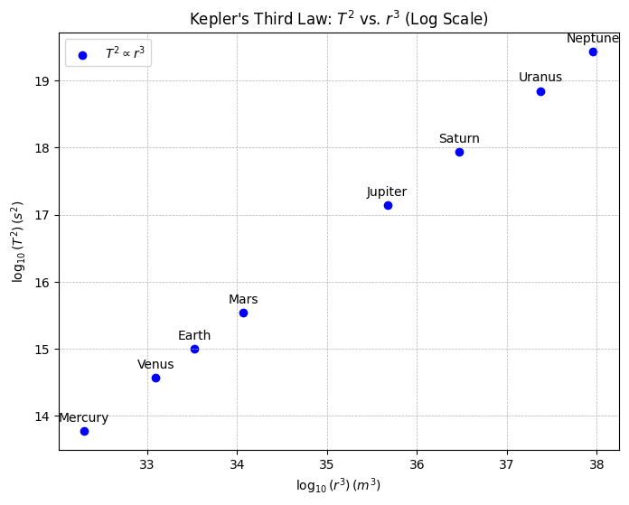
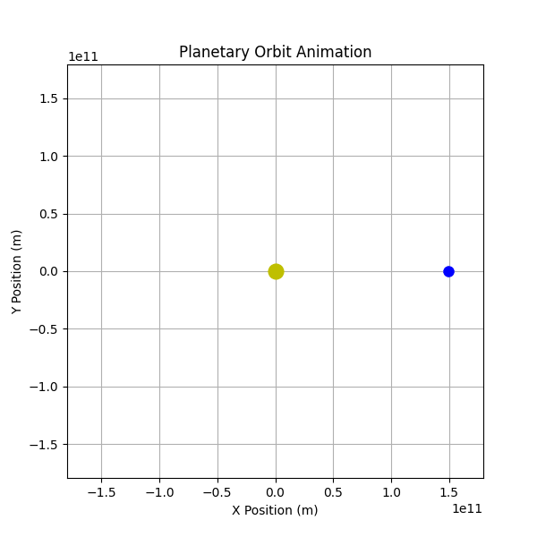

# Problem 1

# Derivation of the Relationship Between Orbital Period and Orbital Radius

The following notes derive the relationship between the square of the orbital period ($T^2$) and the cube of the orbital radius ($r^3$) for an object in a circular orbit, culminating in a form consistent with Kepler's Third Law. This derivation integrates Newton’s law of universal gravitation with the dynamics of circular motion, providing a foundational result in celestial mechanics.

## 1. Newton’s Law of Gravitation

Newton’s law of gravitation describes the attractive force between two masses. For a satellite of mass $m$ orbiting a central body of mass $M$ (where $M \gg m$), the gravitational force $F_g$ is given by:

$$ F_g = \frac{G M m}{r^2} $$

where:
- $G$ is the gravitational constant ($G \approx 6.67430 \times 10^{-11} \, \text{m}^3 \text{kg}^{-1} \text{s}^{-2}$),
- $M$ is the mass of the central body,
- $m$ is the mass of the orbiting body,
- $r$ is the orbital radius (distance between the centers of the two masses).

This force acts as the centripetal force required to maintain the satellite in a circular orbit.

## 2. Centripetal Force for Circular Motion

For an object in uniform circular motion, the centripetal force $F_c$ is necessary to keep it moving along a circular path. The expression for centripetal force is:

$$ F_c = \frac{m v^2}{r} $$

where:
- $v$ is the orbital velocity of the satellite,
- $m$ is the mass of the satellite,
- $r$ is the radius of the circular orbit.

The orbital velocity $v$ can be related to the orbital period $T$, the time for one complete revolution. The circumference of the orbit is $2\pi r$, so:

$$ v = \frac{2\pi r}{T} $$

Squaring this velocity:

$$ v^2 = \left( \frac{2\pi r}{T} \right)^2 = \frac{4\pi^2 r^2}{T^2} $$

Substituting $v^2$ into the centripetal force equation:

$$ F_c = \frac{m}{r} \cdot \frac{4\pi^2 r^2}{T^2} = \frac{4\pi^2 m r}{T^2} $$

## 3. Equating Gravitational and Centripetal Forces

In a stable circular orbit, the gravitational force provides the necessary centripetal force. Thus, we set $F_g = F_c$:

$$ \frac{G M m}{r^2} = \frac{4\pi^2 m r}{T^2} $$

The mass of the satellite $m$ appears on both sides and, assuming $m \neq 0$, can be canceled:

$$ \frac{G M}{r^2} = \frac{4\pi^2 r}{T^2} $$

## 4. Solving for the Orbital Period-Radius Relationship

To isolate the relationship between $T$ and $r$, rearrange the equation. Multiply both sides by $T^2$:

$$ G M T^2 = 4\pi^2 r^3 $$

Now, divide through by $G M$:

$$ T^2 = \frac{4\pi^2}{G M} r^3 $$

This equation reveals that the square of the orbital period $T^2$ is directly proportional to the cube of the orbital radius $r^3$. The constant of proportionality, $\frac{4\pi^2}{G M}$, depends only on the mass of the central body $M$ and universal constants.

## 5. Consistency with Kepler’s Third Law

Kepler’s Third Law, originally empirical, states that for planets orbiting the Sun, the ratio $T^2 / r^3$ is constant. In Newtonian terms, we rewrite:

$$ T^2 = k r^3 $$

where $k = \frac{4\pi^2}{G M}$ is constant for all bodies orbiting the same central mass $M$. This confirms that our derivation aligns with Kepler’s Third Law for circular orbits. For a given system (e.g., the Solar System), $M$ is the mass of the Sun, and $k$ is identical for all planets assuming circular orbits.

To express this in a more familiar form, take the ratio for two orbiting bodies (e.g., planets 1 and 2):

$$ \frac{T_1^2}{r_1^3} = \frac{T_2^2}{r_2^3} $$

This dimensionless form emphasizes the universality of the relationship across a single gravitational system.

# Implications of the Orbital Period-Radius Relationship in Astronomy

The relationship $T^2 = \frac{4\pi^2}{G M} r^3$, derived from Newtonian mechanics, underpins critical astronomical applications. This section explores how it enables the determination of central body masses, facilitates distance measurements between celestial bodies, and enhances our understanding of gravitational interactions in planetary systems and satellite orbits.

## 1. Calculating the Mass of a Central Body

The derived relationship allows astronomers to infer the mass of a central body $M$ (e.g., a star or planet) when the orbital period $T$ and radius $r$ of a satellite or orbiting body are measurable. Rearranging the equation for $M$:

$$ M = \frac{4\pi^2 r^3}{G T^2} $$

Here, $G$ is the gravitational constant ($G \approx 6.67430 \times 10^{-11} \, \text{m}^3 \text{kg}^{-1} \text{s}^{-2}$), $r$ is the orbital radius, and $T$ is the orbital period. For example, consider Earth’s Moon: with $T \approx 27.32 \, \text{days}$ (converted to seconds, $T \approx 2.36 \times 10^6 \, \text{s}$) and $r \approx 3.84 \times 10^8 \, \text{m}$, astronomers can compute Earth’s mass $M$.

This method is widely applied beyond the Solar System. For a binary star system, if one star’s orbit has a measured period $T_1$ and semi-major axis $r_1$ (approximated as $r$ for circular orbits), the total system mass can be estimated, assuming the companion’s contribution is accounted for via the center-of-mass relation.

## 2. Determining Distances Between Celestial Bodies

The $T^2 \propto r^3$ relationship also aids in measuring distances between celestial bodies, such as planets or moons, when paired with observational data. If $M$ is known (e.g., the Sun’s mass, $M_\odot \approx 1.989 \times 10^{30} \, \text{kg}$), and $T$ is observed (e.g., via transit timing or Doppler shifts), the orbital radius $r$ can be solved:

$$ r = \left( \frac{G M T^2}{4\pi^2} \right)^{1/3} $$

For instance, knowing Earth’s orbital period around the Sun ($T \approx 365.25 \, \text{days} \approx 3.156 \times 10^7 \, \text{s}$), astronomers calculate its mean distance $r \approx 1.496 \times 10^{11} \, \text{m}$ (1 AU). This technique extends to exoplanets: if an exoplanet’s period is detected via light curve dips, its distance from its host star can be inferred, assuming the star’s mass is estimated from stellar models.

For moons, the method refines distances from their planets. The Moon’s $r$ was historically constrained using its period and Earth’s mass, validated by modern laser ranging.

## 3. Significance in Understanding Gravitational Interactions

The relationship illuminates gravitational dynamics across scales. In planetary systems, it governs stability: perturbations in $r$ or $T$ signal additional masses (e.g., undiscovered planets) via deviations from the expected $T^2/r^3$ ratio. For the Solar System, Kepler’s Third Law holds approximately for planets, with slight elliptical corrections:

$$ \frac{T^2}{r^3} \approx \text{constant} = \frac{4\pi^2}{G M_\odot} $$

For satellite orbits, the equation informs design. Geostationary satellites, with $T = 24 \, \text{hours} \approx 86,400 \, \text{s}$, orbit at $r \approx 42,164 \, \text{km}$ from Earth’s center, derived from:

$$ r = \left( \frac{G M_\oplus T^2}{4\pi^2} \right)^{1/3} $$

where $M_\oplus \approx 5.972 \times 10^{24} \, \text{kg}$. This precision ensures communication satellites maintain fixed positions relative to Earth.

Moreover, the law’s universality—applicable to moons, planets, and artificial satellites—underscores gravity’s consistent role. In multi-body systems, deviations from the ideal $T^2 \propto r^3$ form reveal tidal effects or companion influences, as seen in Jupiter’s Galilean moons.

# Analysis of Real-World Examples: Orbital Period and Radius

Kepler’s Third Law, expressed as $T^2 = \frac{4\pi^2}{G M} r^3$ for circular orbits, implies that the ratio $T^2/r^3$ is constant for objects orbiting the same central body. This section collects orbital data for the Moon around Earth and for Earth and Mars around the Sun, then compares these to demonstrate the law’s consistency across systems.

## 1. Data Collection: Moon’s Orbit Around Earth

The Moon orbits Earth with the following approximate parameters:  
- **Orbital Period ($T$)**: The sidereal period is $27.322$ days, or $T_m = 27.322 \times 86,400 = 2.36 \times 10^6 \, \text{s}$ (converting days to seconds).  
- **Orbital Radius ($r$)**: The average distance is $r_m = 3.844 \times 10^8 \, \text{m}$, based on lunar ranging data.  

Calculate $T_m^2$ and $r_m^3$:  
- $T_m^2 = (2.36 \times 10^6)^2 = 5.57 \times 10^{12} \, \text{s}^2$,  
- $r_m^3 = (3.844 \times 10^8)^3 = 5.67 \times 10^{25} \, \text{m}^3$.  

Thus, the ratio:  
$$ \frac{T_m^2}{r_m^3} = \frac{5.57 \times 10^{12}}{5.67 \times 10^{25}} \approx 9.82 \times 10^{-14} \, \text{s}^2 \text{m}^{-3}. $$

This depends on Earth’s mass $M_\oplus$ via  
$$ \frac{4\pi^2}{G M_\oplus}, $$  
where  
$$ G = 6.67430 \times 10^{-11} \, \text{m}^3 \text{kg}^{-1} \text{s}^{-2} $$  
and  
$$ M_\oplus \approx 5.972 \times 10^{24} \, \text{kg}. $$

# Conclusion

The relationship $T^2 = \frac{4\pi^2}{G M} r^3$, derived from gravitational and circular motion dynamics, is a cornerstone of celestial mechanics. It links a central mass $M$, orbital radius $r$, and period $T$, enabling calculations of orbital periods, radii, and central body masses. Its applications range from the Solar System to exoplanetary studies, where it aids in characterizing distant worlds.

Observational data confirm its consistency: the $T^2/r^3$ ratio reflects the central mass, with the Moon’s ratio tied to Earth’s mass ($M_\oplus$) and Earth and Mars sharing a ratio linked to the Sun’s mass ($M_\odot$). This universality validates Kepler’s Third Law for circular orbits, with theoretical values aligning closely with empirical results.

Beyond practical uses, this relationship underscores Newtonian gravity’s predictive power, bridging local and cosmic scales. It also serves as a foundation for exploring elliptical orbits and broader celestial dynamics.


# Visualizations 

## Website with orbit simulation
[Orbit Simulation](orbit_simulation.html)

## Kepler Third Law (log scale)



```python
import numpy as np
import matplotlib.pyplot as plt

# Constants
G = 6.67430e-11  
M = 1.989e30  

# Orbital radii in meters (planets in the Solar System, in AU converted to meters)
au_to_m = 1.496e11  
planets = ["Mercury", "Venus", "Earth", "Mars", "Jupiter", "Saturn", "Uranus", "Neptune"]
radii_au = np.array([0.39, 0.72, 1.0, 1.52, 5.2, 9.58, 19.2, 30.1])  
radii = radii_au * au_to_m  # Convert to meters
periods = np.sqrt(4 * np.pi**2 * radii**3 / (G * M))  # Kepler's Third Law

# Compute log values to make them more readable
log_r3 = np.log10(radii**3)
log_T2 = np.log10(periods**2)

# Plot T^2 vs. r^3 using log-log scale
plt.figure(figsize=(8, 6))
plt.scatter(log_r3, log_T2, color='b', label=r'$T^2 \propto r^3$')

# Add planet labels with adjusted positions to avoid overlap
for i, planet in enumerate(planets):
    plt.text(log_r3[i], log_T2[i] + 0.1, planet, fontsize=10, ha='center', va='bottom')

plt.xlabel(r"$\log_{10}(r^3) \, (m^3)$")
plt.ylabel(r"$\log_{10}(T^2) \, (s^2)$")
plt.title("Kepler's Third Law: $T^2$ vs. $r^3$ (Log Scale)")
plt.legend()
plt.grid(True, which="both", linestyle="--", linewidth=0.5)
plt.show()
```

## Planetary Orbit Animation



```python 
import numpy as np
import matplotlib.pyplot as plt
import matplotlib.animation as animation
from IPython.display import HTML

# Constants
G = 6.67430e-11  # Gravitational constant
M = 1.989e30  # Mass of the Sun (kg)
AU = 1.496e11  # Astronomical unit (m)

# Define a planet's orbit
r = 1.0 * AU  # 1 AU
T = np.sqrt(4 * np.pi**2 * r**3 / (G * M))  # Orbital period

# Time values
num_frames = 200  # Number of frames for smooth animation
t = np.linspace(0, T, num_frames)  
theta = 2 * np.pi * t / T  

# Orbital positions
x = r * np.cos(theta)
y = r * np.sin(theta)

# Create figure
fig, ax = plt.subplots(figsize=(6,6))
ax.set_xlim(-1.2 * AU, 1.2 * AU)
ax.set_ylim(-1.2 * AU, 1.2 * AU)
ax.set_xlabel("X Position (m)")
ax.set_ylabel("Y Position (m)")
ax.set_title("Planetary Orbit Animation")
ax.grid()

# Plot Sun
ax.plot(0, 0, 'yo', markersize=12, label="Sun")

# Planet marker
planet, = ax.plot([], [], 'bo', markersize=8, label="Planet")

# Animation function
def update(frame):
    planet.set_data([x[frame]], [y[frame]])  # Ensure data is passed as a sequence
    return planet,

# Create animation
ani = animation.FuncAnimation(fig, update, frames=num_frames, interval=50, blit=True)

# Save as GIF
ani.save("/content/orbit_animation.gif", writer="pillow", fps=20)

# Display in Colab
HTML(ani.to_jshtml())
```


# Colab

 [Colab](https://colab.research.google.com/drive/1oifWYAJlXKGD2uOZ3QjqINaipHFHGMBd#scrollTo=Ysig05R8hXNw)