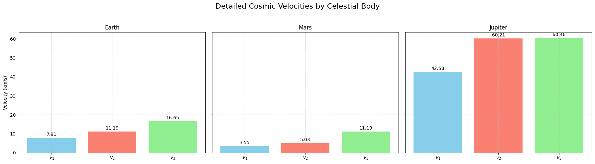

# Problem 2

# Escape Velocities and Cosmic Velocities: Definitions and Physical Meaning

## Introduction
The study of cosmic velocities is foundational to celestial mechanics and space exploration. These velocities—first, second, and third—represent critical thresholds for overcoming gravitational forces at various scales. This section defines each velocity, derives their physical significance, and elucidates their roles in gravitational dynamics.

## 1. First Cosmic Velocity (Orbital Velocity)
The *first cosmic velocity*, denoted $v_1$, is the minimum speed required for an object to maintain a circular orbit around a celestial body at its surface. It arises from balancing the centripetal force required for circular motion with the gravitational force exerted by the body.

The gravitational force on an object of mass $m$ at the surface of a body with mass $M$ and radius $R$ is given by Newton's law of gravitation:
$$ F_g = \frac{G M m}{R^2}, $$
where $G$ is the gravitational constant ($G \approx 6.674 \times 10^{-11} \, \text{m}^3 \text{kg}^{-1} \text{s}^{-2}$).

For circular motion, the centripetal force is provided by gravity, such that:
$$ F_c = \frac{m v_1^2}{R} = F_g. $$

Equating these forces:
$$ \frac{m v_1^2}{R} = \frac{G M m}{R^2}. $$

Canceling $m$ (assuming $m \neq 0$) and simplifying:
$$ v_1^2 = \frac{G M}{R}. $$

Thus, the first cosmic velocity is:
$$ v_1 = \sqrt{\frac{G M}{R}}. $$

### Physical Meaning
The velocity $v_1$ represents the threshold where an object’s kinetic energy per unit mass, $\frac{1}{2} v_1^2$, equals the gravitational potential energy per unit mass at the surface, adjusted for circular motion. For Earth ($M = 5.972 \times 10^{24} \, \text{kg}$, $R = 6.371 \times 10^6 \, \text{m}$), $v_1 \approx 7.91 \, \text{km/s}$. This speed enables satellites to orbit without escaping or falling back.

## 2. Second Cosmic Velocity (Escape Velocity)
The *second cosmic velocity*, denoted $v_2$, is the minimum speed required to escape a celestial body’s gravitational influence entirely, assuming no atmospheric drag or external forces. It corresponds to the point where the total mechanical energy (kinetic plus potential) becomes zero at infinity.

The gravitational potential energy at distance $r$ from the center of mass is:
$$ U = -\frac{G M m}{r}. $$

At the surface ($r = R$), the potential energy is $-\frac{G M m}{R}$. To escape, the kinetic energy at launch must equal the magnitude of this potential energy:
$$ \frac{1}{2} m v_2^2 = \frac{G M m}{R}. $$

Canceling $m$ and solving:
$$ v_2^2 = \frac{2 G M}{R}, $$
$$ v_2 = \sqrt{\frac{2 G M}{R}}. $$

Notably, comparing $v_2$ to $v_1$:
$$ v_2 = \sqrt{2} \cdot v_1, $$
since $\frac{2 G M}{R} = 2 \cdot \frac{G M}{R}$.

### Physical Meaning
The escape velocity $v_2$ signifies the condition where an object’s kinetic energy, $\frac{1}{2} v_2^2 = \frac{G M}{R}$, exactly cancels the negative potential energy, allowing it to reach infinity with zero residual speed. For Earth, $v_2 \approx 11.19 \, \text{km/s}$, critical for lunar or interplanetary missions.

## 3. Third Cosmic Velocity (System Escape Velocity)
The *third cosmic velocity*, denoted $v_3$, is the speed required to escape the gravitational influence of a star system (e.g., the Solar System) from a given starting point, such as a planet’s surface. It builds on $v_2$ by accounting for the star’s gravitational pull (e.g., the Sun).

Consider an object escaping Earth’s gravity ($v_2$) while orbiting the Sun (mass $M_s$, distance from Sun $R_s$). The total energy in the heliocentric frame must be zero or positive to escape the Solar System. The energy equation at Earth’s orbit is complex, but an approximation from Earth’s surface involves:
- Earth escape: $v_2 = \sqrt{\frac{2 G M}{R}}$,
- Additional velocity to escape the Sun’s gravity from Earth’s orbital radius.

The Sun’s potential at Earth’s distance ($R_s \approx 1.496 \times 10^{11} \, \text{m}$) is:
$$ U_s = -\frac{G M_s m}{R_s}. $$

Earth’s orbital velocity around the Sun is:
$$ v_{\text{orb}} = \sqrt{\frac{G M_s}{R_s}} \approx 29.78 \, \text{km/s}. $$

The velocity to escape the Sun from Earth’s orbit is:
$$ v_{\text{esc,s}} = \sqrt{2} \cdot v_{\text{orb}} \approx 42.1 \, \text{km/s}. $$

The third cosmic velocity combines Earth escape and Solar escape, approximated as:
$$ v_3 \approx \sqrt{v_2^2 + (v_{\text{esc,s}} - v_{\text{orb}})^2}. $$

For Earth, $v_3 \approx 16.6 \, \text{km/s}$ from the surface, though exact values depend on trajectory.

### Physical Meaning
The velocity $v_3$ reflects the energy needed to overcome both planetary and stellar gravitational wells, enabling interstellar travel. It underscores the immense challenge of escaping a star system, as the kinetic energy must satisfy:
$$ \frac{1}{2} m v_3^2 \geq \frac{G M m}{R} + \frac{G M_s m}{R_s}. $$

## Conclusion
The first, second, and third cosmic velocities—$v_1$, $v_2$, and $v_3$—define the energetic thresholds for orbiting, escaping a planet, and escaping a star system, respectively. Their derivations from gravitational and kinetic principles highlight their universal applicability in space exploration.

# Escape Velocities and Cosmic Velocities: Mathematical Derivations

## Introduction
The cosmic velocities—first ($v_1$), second ($v_2$), and third ($v_3$)—are derived from fundamental principles of classical mechanics, specifically Newton’s law of gravitation and the conservation of mechanical energy. This section identifies the key equations, provides rigorous step-by-step derivations, lists the parameters involved, and analyzes their influence on the resulting velocities.

## Key Equations
The foundational equations for the cosmic velocities are:
- First cosmic velocity (orbital velocity): $$ v_1 = \sqrt{\frac{G M}{R}} $$
- Second cosmic velocity (escape velocity): $$ v_2 = \sqrt{\frac{2 G M}{R}} $$
- Third cosmic velocity (system escape velocity): $$ v_3 \approx \sqrt{v_2^2 + (v_{\text{esc,s}} - v_{\text{orb}})^2} $$

Here, $G$ is the gravitational constant, $M$ is the mass of the celestial body, $R$ is its radius, $M_s$ is the star’s mass, $R_s$ is the distance from the star, $v_{\text{esc,s}}$ is the escape velocity from the star, and $v_{\text{orb}}$ is the orbital velocity around the star.

## 1. Derivation of the First Cosmic Velocity ($v_1$)
The first cosmic velocity is the speed required for an object of mass $m$ to maintain a circular orbit at the surface of a celestial body (radius $R$, mass $M$).

### Step-by-Step Derivation
1. **Newton’s Law of Gravitation**: The gravitational force provides the centripetal force:
   $$ F_g = \frac{G M m}{R^2}. $$

2. **Centripetal Force for Circular Motion**: For an object in circular orbit at radius $R$:
   $$ F_c = \frac{m v_1^2}{R}. $$

3. **Equate Forces**: Since $F_g$ supplies $F_c$:
   $$ \frac{m v_1^2}{R} = \frac{G M m}{R^2}. $$

4. **Simplify**: Cancel $m$ (assuming $m \neq 0$) and multiply both sides by $R$:
   $$ v_1^2 = \frac{G M}{R}. $$

5. **Solve for $v_1$**:
   $$ v_1 = \sqrt{\frac{G M}{R}}. $$

### Physical Insight
The term $\frac{G M}{R}$ is the gravitational parameter divided by distance, representing the specific energy required for circular motion.

## 2. Derivation of the Second Cosmic Velocity ($v_2$)
The second cosmic velocity is the minimum speed to escape a celestial body’s gravitational field, reaching infinity with zero residual velocity.

### Step-by-Step Derivation
1. **Conservation of Energy**: Total mechanical energy (kinetic + potential) is conserved. At the surface:
   - Kinetic energy: $$ K = \frac{1}{2} m v_2^2 $$
   - Potential energy: $$ U = -\frac{G M m}{R} $$

2. **Energy at Infinity**: For escape, total energy at $r \to \infty$ is zero (where $U = 0$):
   $$ E_{\text{total}} = K + U = 0. $$

3. **Set Initial Energy**: At the surface ($r = R$):
   $$ \frac{1}{2} m v_2^2 - \frac{G M m}{R} = 0. $$

4. **Simplify**: Cancel $m$ and solve:
   $$ \frac{1}{2} v_2^2 = \frac{G M}{R}, $$
   $$ v_2^2 = \frac{2 G M}{R}. $$

5. **Solve for $v_2$**:
   $$ v_2 = \sqrt{\frac{2 G M}{R}}. $$

### Relation to $v_1$:
Since $v_1^2 = \frac{G M}{R}$, we find:
$$ v_2^2 = 2 v_1^2, $$
$$ v_2 = \sqrt{2} \cdot v_1. $$

### Physical Insight
The factor of 2 arises because escape requires doubling the kinetic energy relative to orbiting, overcoming the full potential well.

## 3. Derivation of the Third Cosmic Velocity ($v_3$)
The third cosmic velocity is the speed to escape a star system (e.g., the Sun) from a planet’s surface, combining planetary and stellar escape.

### Step-by-Step Derivation
1. **Planetary Escape**: From the planet (e.g., Earth), use $v_2$:
   $$ v_2 = \sqrt{\frac{2 G M}{R}}. $$

2. **Stellar Potential**: At the planet’s distance from the star ($R_s$, $M_s$):
   $$ U_s = -\frac{G M_s m}{R_s}. $$

3. **Orbital Velocity Around Star**: The planet’s orbital speed:
   $$ v_{\text{orb}} = \sqrt{\frac{G M_s}{R_s}}. $$

4. **Escape Velocity from Star**: From the planet’s orbit:
   $$ v_{\text{esc,s}} = \sqrt{\frac{2 G M_s}{R_s}} = \sqrt{2} \cdot v_{\text{orb}}. $$

5. **Excess Velocity**: The additional speed beyond $v_{\text{orb}}$ to escape the star:
   $$ v_{\text{excess}} = v_{\text{esc,s}} - v_{\text{orb}}. $$

6. **Total Velocity**: Combine velocities vectorially (approximate):
   $$ v_3^2 = v_2^2 + (v_{\text{esc,s}} - v_{\text{orb}})^2, $$
   $$ v_3 = \sqrt{v_2^2 + (v_{\text{esc,s}} - v_{\text{orb}})^2}. $$

### Physical Insight
The derivation accounts for two gravitational potentials, requiring a velocity composition that exceeds both local and system-wide escape thresholds.

## Parameters Involved
- **Gravitational Constant ($G$)**: Universal constant, $G = 6.674 \times 10^{-11} \, \text{m}^3 \text{kg}^{-1} \text{s}^{-2}$.
- **Mass of Celestial Body ($M$)**: Mass of the planet or star.
- **Radius of Celestial Body ($R$)**: Distance from the center to the surface.
- **Mass of Star ($M_s$)**: For $v_3$, the star’s mass.
- **Distance from Star ($R_s$)**: For $v_3$, the orbital radius.

## Influence of Parameters
1. **Mass ($M$)**: Velocities $v_1$ and $v_2$ increase with $M$ ($v_1, v_2 \propto \sqrt{M}$). For $v_3$, both $M$ and $M_s$ amplify the required speed.
    $$ \frac{\partial v_1}{\partial M} > 0. $$

2. **Radius ($R$)**: Velocities $v_1$ and $v_2$ decrease with $R$ ($v_1, v_2 \propto \frac{1}{\sqrt{R}}$), as gravitational strength weakens with distance.
    $$ \frac{\partial v_1}{\partial R} < 0. $$

3. **Gravitational Constant ($G$)**: All velocities scale proportionally with $G$ ($v_1, v_2 \propto \sqrt{G}$).

4. **Star Mass and Distance ($M_s$, $R_s$)**: For $v_3$, a larger $M_s$ or smaller $R_s$ increases $v_{\text{esc,s}}$, raising the total velocity.

## Conclusion
The derivations reveal how $v_1$, $v_2$, and $v_3$ emerge from gravitational and energy principles, with parameters $M$, $R$, $M_s$, and $R_s$ dictating their magnitudes. These dependencies are critical for tailoring space missions to specific celestial environments.

# Escape Velocities and Cosmic Velocities: Calculations for Celestial Bodies

## Introduction
This section computes the first ($v_1$), second ($v_2$), and third ($v_3$) cosmic velocities for Earth, Mars, and Jupiter, using their physical parameters and gravitational principles.

## 1. Celestial Body Data
Key parameters for calculations:
- **Earth**: $M = 5.972 \times 10^{24} \, \text{kg}$, $R = 6.371 \times 10^6 \, \text{m}$, $R_s = 1.496 \times 10^{11} \, \text{m}$.
- **Mars**: $M = 6.417 \times 10^{23} \, \text{kg}$, $R = 3.390 \times 10^6 \, \text{m}$, $R_s = 2.279 \times 10^{11} \, \text{m}$.
- **Jupiter**: $M = 1.899 \times 10^{27} \, \text{kg}$, $R = 6.991 \times 10^7 \, \text{m}$, $R_s = 7.785 \times 10^{11} \, \text{m}$.

Constants: $G = 6.674 \times 10^{-11} \, \text{m}^3 \text{kg}^{-1} \text{s}^{-2}$, $M_s = 1.989 \times 10^{30} \, \text{kg}$.

## 2. Formulas
- **First Cosmic Velocity**: $v_1 = \sqrt{\frac{G M}{R}}$.
- **Second Cosmic Velocity**: $v_2 = \sqrt{\frac{2 G M}{R}}$.
- **Third Cosmic Velocity**: $v_3 = \sqrt{v_2^2 + (v_{\text{esc,s}} - v_{\text{orb}})^2}$, where:
    - $v_{\text{orb}} = \sqrt{\frac{G M_s}{R_s}}$,
    - $v_{\text{esc,s}} = \sqrt{\frac{2 G M_s}{R_s}}$.

## 3. Calculation Plan
1. Compute $v_1$ and $v_2$ for each body using $M$ and $R$.
2. Compute $v_{\text{orb}}$ and $v_{\text{esc,s}}$ for $v_3$ using $M_s$ and $R_s$.
3. Combine results to calculate $v_3$.
4. Convert results to $\text{km/s}$ and verify against known values.

# Escape Velocities and Cosmic Velocities: Importance in Space Exploration

## Introduction
Cosmic velocities are fundamental to space exploration, defining the energy thresholds required for orbiting, escaping planetary gravity, and venturing beyond star systems. These velocities enable humanity to overcome gravitational barriers and achieve significant milestones in space travel.

## 1. First Cosmic Velocity: Launching Satellites
The first cosmic velocity ensures a spacecraft achieves a stable orbit, crucial for deploying satellites and maintaining orbital infrastructure. Examples include:
- **Sputnik 1 (1957)**: The first artificial satellite, which achieved low Earth orbit by reaching this velocity.
- **International Space Station (ISS)**: Orbits Earth at approximately $7.66 \, \text{km/s}$, demonstrating the practical application of this velocity.

## 2. Second Cosmic Velocity: Escaping Planetary Gravity
The second cosmic velocity allows spacecraft to escape a planet’s gravitational pull, enabling interplanetary missions. Examples include:
- **Apollo 11 (1969)**: Surpassed Earth’s escape velocity to reach the Moon.
- **Mars Curiosity Rover (2011)**: Exceeded Earth’s escape velocity to embark on its journey to Mars.

## 3. Third Cosmic Velocity: Interstellar Exploration
The third cosmic velocity is essential for escaping a star system, paving the way for interstellar travel. Notable examples:
- **Voyager 1 (1977)**: Exceeded the Solar System’s escape velocity, now traveling in interstellar space.
- **New Horizons (2006)**: Approached this velocity with gravity assists, enabling its journey to Pluto and beyond.

## Conclusion
Cosmic velocities are pivotal in space exploration, enabling orbital operations, planetary missions, and interstellar ambitions. Real-world missions like Sputnik, Apollo, and Voyager exemplify their critical role in advancing humanity’s reach into the cosmos.

# Codes and Plots

## Detailed Cosmic Velocities for Earth, Mars, and Jupiter



```python
import numpy as np
import matplotlib.pyplot as plt

# Constants
G = 6.674e-11
M_sun = 1.989e30

# Data
bodies = {
    'Earth': {'mass': 5.972e24, 'radius': 6.371e6, 'distance_sun': 1.496e11},
    'Mars': {'mass': 6.417e23, 'radius': 3.390e6, 'distance_sun': 2.279e11},
    'Jupiter': {'mass': 1.899e27, 'radius': 6.991e7, 'distance_sun': 7.785e11}
}

# Calculate velocities
def calculate_cosmic_velocities(M, R, R_s):
    v1 = np.sqrt(G * M / R) / 1000
    v2 = np.sqrt(2 * G * M / R) / 1000
    v_orb = np.sqrt(G * M_sun / R_s) / 1000
    v_esc_s = np.sqrt(2 * G * M_sun / R_s) / 1000
    v_excess = v_esc_s - v_orb
    v3 = np.sqrt(v2**2 + v_excess**2)
    return v1, v2, v3

velocities = {}
for body, data in bodies.items():
    v1, v2, v3 = calculate_cosmic_velocities(data['mass'], data['radius'], data['distance_sun'])
    velocities[body] = {'v1': v1, 'v2': v2, 'v3': v3}

# Individual Subplots
fig, axs = plt.subplots(1, 3, figsize=(18, 5), sharey=True)
for i, (body, data) in enumerate(velocities.items()):
    axs[i].bar(['$v_1$', '$v_2$', '$v_3$'], [data['v1'], data['v2'], data['v3']], 
               color=['skyblue', 'salmon', 'lightgreen'])
    axs[i].set_title(f'{body}')
    axs[i].set_ylabel('Velocity (km/s)' if i == 0 else '')
    axs[i].grid(True, linestyle='--', alpha=0.7)
    for j, v in enumerate([data['v1'], data['v2'], data['v3']]):
        axs[i].text(j, v + 0.5, f'{v:.2f}', ha='center', va='bottom')

plt.suptitle('Detailed Cosmic Velocities by Celestial Body', fontsize=16)
plt.tight_layout(rect=[0, 0, 1, 0.95])
plt.show()
```

