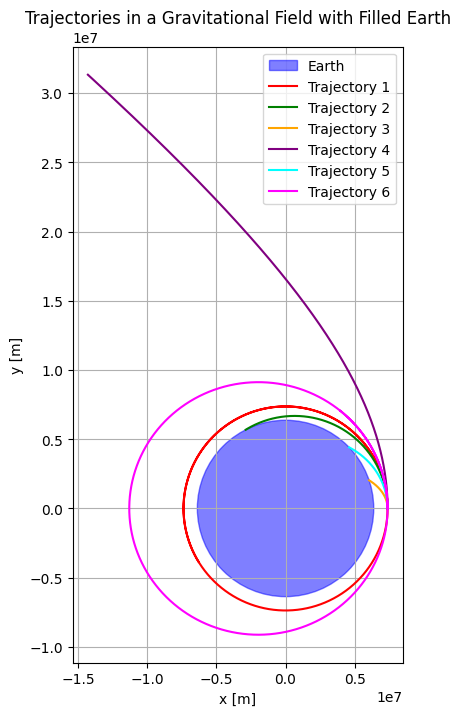
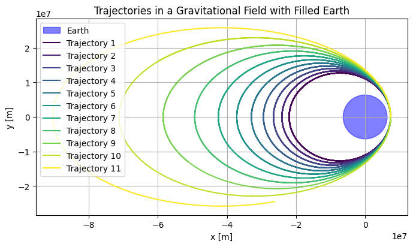
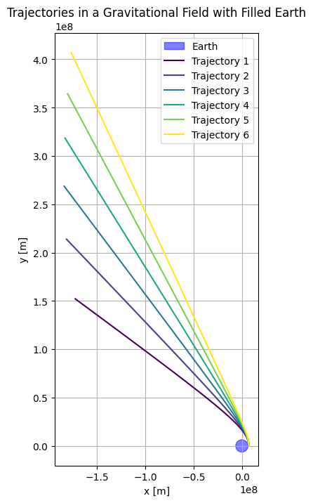

# Problem 3

## Orbital Mechanics Simulator
[Orbital Mechanics Simulator](simulation.html)

# Theoretical Analysis of Payload Trajectories Near Earth

This section outlines the theoretical framework for analyzing payload trajectories near Earth, using Newton's Law of Gravitation, Kepler's Laws, and energy considerations. We assume a two-body problem with Earth as the dominant gravitational influence, neglecting atmospheric drag and other perturbations.

## 1. Derivation of Equations of Motion

The motion of a payload near Earth is governed by Newton's Law of Gravitation:

$$ \mathbf{F} = -\frac{G M m}{|\mathbf{r}|^3} \mathbf{r}, $$

where $G$ is the gravitational constant, $M$ is Earth's mass, and $\mathbf{r}$ is the position vector. Applying Newton's Second Law, $\mathbf{F} = m \mathbf{a}$, yields:

$$ \ddot{\mathbf{r}} = -\frac{G M}{|\mathbf{r}|^3} \mathbf{r}. $$

Defining $\mu = G M$, the equation becomes:

$$ \ddot{\mathbf{r}} = -\frac{\mu}{r^3} \mathbf{r}, $$

where $r = |\mathbf{r}|$. In polar coordinates, the radial and tangential components are:

$$ \ddot{r} - r \dot{\theta}^2 = -\frac{\mu}{r^2}, \quad r \ddot{\theta} + 2 \dot{r} \dot{\theta} = 0. $$

The second equation implies conservation of angular momentum, $r^2 \dot{\theta} = h$, where $h$ is constant.

## 2. Application of Kepler's Laws

Kepler's Laws describe orbital characteristics:

1. **First Law**: Orbits are conic sections with Earth at one focus. The orbit equation is:

    $$ r = \frac{a (1 - e^2)}{1 + e \cos \theta}, $$

    where $a$ is the semi-major axis, $e$ is the eccentricity, and $\theta$ is the true anomaly.

2. **Second Law**: Equal areas are swept in equal times, implying constant areal velocity:

    $$ \frac{dA}{dt} = \frac{1}{2} r^2 \dot{\theta} = \frac{h}{2}. $$

3. **Third Law**: For elliptical orbits, the orbital period $T$ is:

    $$ T^2 = \frac{4 \pi^2}{\mu} a^3. $$

## 3. Identification of Trajectory Types

The trajectory type depends on the specific mechanical energy $\epsilon$:

$$ \epsilon = \frac{v^2}{2} - \frac{\mu}{r}, $$

where $v$ is the speed. Trajectories are classified as:

- **Elliptical ($\epsilon < 0$)**: Bound orbit, with $a = -\frac{\mu}{2 \epsilon}$.
- **Parabolic ($\epsilon = 0$)**: Escape trajectory, $v = \sqrt{\frac{2 \mu}{r}}$.
- **Hyperbolic ($\epsilon > 0$)**: Unbound, with excess speed $v_\infty = \sqrt{2 \epsilon}$.

Eccentricity $e$ is related to $\epsilon$ and angular momentum $h$:

$$ e = \sqrt{1 + \frac{2 \epsilon h^2}{\mu^2}}. $$

## 4. Definition of Initial Conditions

The trajectory is determined by the initial state vector $(\mathbf{r}_0, \mathbf{v}_0)$:

- **Position**: $\mathbf{r}_0 = (x_0, y_0, z_0)$ or altitude $h$, with $r_0 = R_E + h$.
- **Velocity**: $\mathbf{v}_0 = (v_x, v_y, v_z)$ or speed $v_0$ and flight path angle $\gamma$.
- **Altitude**: $h$ determines $r_0$, with $R_E \approx 6,371 \, \text{km}$.

Specific angular momentum is:

$$ \mathbf{h} = \mathbf{r}_0 \times \mathbf{v}_0. $$

---


# Numerical Analysis of Payload Trajectory

This section performs a numerical analysis to propagate the trajectory of a payload released near Earth, using the numerical methods outlined previously. We compute example calculations for a specific case with initial conditions $r_0 = 6,571 \, \text{km}$ (corresponding to an altitude $h \approx 200 \, \text{km}$ above Earth's mean radius $R_E \approx 6,371 \, \text{km}$) and initial speed $v_0 = 7.8 \, \text{km/s}$. The analysis illustrates the application of the numerical integration scheme to determine the payload's path, providing a foundation for subsequent simulations and visualizations.

## Example Trajectory Propagation

To propagate the trajectory, we solve the two-body equation of motion:

$$ \ddot{\mathbf{r}} = -\frac{\mu}{r^3} \mathbf{r}, $$

where $\mu \approx 3.986 \times 10^{14} \, \text{m}^3 \text{s}^{-2}$ is Earth's gravitational parameter, and $r = |\mathbf{r}|$. We use the Runge-Kutta method of order 4 (RK4) to integrate the system, converted to first-order ODEs with state vector $\mathbf{y} = [\mathbf{r}, \mathbf{v}]^T$:

$$ \frac{d\mathbf{y}}{dt} = \begin{bmatrix} \mathbf{v} \\ -\frac{\mu}{r^3} \mathbf{r} \end{bmatrix}. $$


### RK4 Method: General Example

To illustrate the Runge-Kutta 4th-order (RK4) method used in trajectory propagation, we first demonstrate it on a simpler differential equation before applying it to the two-body problem. Consider the first-order ODE:

$$ \frac{dy}{dt} = f(t, y) = y - t^2 + 1, \quad y(0) = 0.5, $$

with a step size \( h = 0.2 \). We compute the next state \( y_1 \) at \( t = 0.2 \).

#### Step 1: Compute Intermediate Increments

The RK4 method calculates four increments:

$$ \begin{aligned}
k_1 &= f(t_0, y_0) = f(0, 0.5) = 0.5 - 0^2 + 1 = 1.5, \\
k_2 &= f\left(t_0 + \frac{h}{2}, y_0 + \frac{h}{2} k_1\right) = f(0.1, 0.5 + 0.1 \cdot 1.5) = f(0.1, 0.575) \\
    &= 0.575 - 0.1^2 + 1 = 0.575 - 0.01 + 1 = 1.565, \\
k_3 &= f\left(t_0 + \frac{h}{2}, y_0 + \frac{h}{2} k_2\right) = f(0.1, 0.5 + 0.1 \cdot 1.565) = f(0.1, 0.57825) \\
    &= 0.57825 - 0.01 + 1 = 1.56825, \\
k_4 &= f(t_0 + h, y_0 + h \cdot k_3) = f(0.2, 0.5 + 0.2 \cdot 1.56825) = f(0.2, 0.81365) \\
    &= 0.81365 - 0.04 + 1 = 1.77365.
\end{aligned} $$

#### Step 2: Update the State

The next state is computed as:

$$ \begin{aligned}
y_1 &= y_0 + \frac{h}{6} (k_1 + 2 k_2 + 2 k_3 + k_4) \\
    &= 0.5 + \frac{0.2}{6} (1.5 + 2 \cdot 1.565 + 2 \cdot 1.56825 + 1.77365) \\
    &= 0.5 + \frac{0.2}{6} (1.5 + 3.13 + 3.1365 + 1.77365) \\
    &= 0.5 + \frac{0.2}{6} \cdot 9.54015 \approx 0.5 + 0.318005 \\
    &= 0.818.
\end{aligned} $$

Thus, \( y(0.2) \approx 0.818 \). This example clarifies the RK4 process, which we apply to the two-body problem in the following steps.

### Initial Conditions Setup
Assume the payload is released at $t = 0$ with position $\mathbf{r}_0 = [r_0, 0, 0]^T = [6,571 \times 10^3, 0, 0]^T \, \text{m}$ in an Earth-centered inertial frame, and velocity $\mathbf{v}_0 = [0, v_0, 0]^T = [0, 7.8 \times 10^3, 0]^T \, \text{m/s}$, corresponding to a tangential release (flight path angle $\gamma = 0^\circ$) in the $xy$-plane. The initial state vector is:

$$ \mathbf{y}_0 = [6,571 \times 10^3, 0, 0, 0, 7.8 \times 10^3, 0]^T. $$

We first compute the specific mechanical energy to classify the trajectory:

$$ \epsilon = \frac{v_0^2}{2} - \frac{\mu}{r_0}. $$

Substituting $v_0 = 7.8 \times 10^3 \, \text{m/s}$, $r_0 = 6,571 \times 10^3 \, \text{m}$, and $\mu = 3.986 \times 10^{14} \, \text{m}^3 \text{s}^{-2}$:

$$ \frac{v_0^2}{2} = \frac{(7.8 \times 10^3)^2}{2} = \frac{60.84 \times 10^6}{2} = 30.42 \times 10^6 \, \text{J/kg}, $$

$$ \frac{\mu}{r_0} = \frac{3.986 \times 10^{14}}{6.571 \times 10^6} \approx 60.66 \times 10^6 \, \text{J/kg}, $$

$$ \epsilon = 30.42 \times 10^6 - 60.66 \times 10^6 = -30.24 \times 10^6 \, \text{J/kg}. $$

Since $\epsilon < 0$, the trajectory is elliptical, indicating a bound orbit. The semi-major axis is:

$$ a = -\frac{\mu}{2 \epsilon} = -\frac{3.986 \times 10^{14}}{2 \times (-30.24 \times 10^6)} \approx 6.59 \times 10^6 \, \text{m} = 6,590 \, \text{km}. $$

### Numerical Integration Step
Using RK4 with a time step $\Delta t = 1 \, \text{s}$, we compute one integration step to illustrate the process. At $t = 0$, evaluate the derivative $\frac{d\mathbf{y}}{dt}$:

- Position derivative: $\dot{\mathbf{r}}_0 = \mathbf{v}_0 = [0, 7.8 \times 10^3, 0]^T \, \text{m/s}$.
- Velocity derivative: $\dot{\mathbf{v}}_0 = -\frac{\mu}{r_0^3} \mathbf{r}_0$, where $r_0 = 6,571 \times 10^3 \, \text{m}$, so:

$$ r_0^3 = (6.571 \times 10^6)^3 \approx 2.835 \times 10^{20} \, \text{m}^3, $$

$$ \frac{\mu}{r_0^3} = \frac{3.986 \times 10^{14}}{2.835 \times 10^{20}} \approx 1.406 \times 10^{-6} \, \text{s}^{-2}, $$

$$ \dot{\mathbf{v}}_0 = -1.406 \times 10^{-6} \cdot [6.571 \times 10^6, 0, 0]^T \approx [-9.24, 0, 0]^T \, \text{m/s}^2. $$

Thus, $\frac{d\mathbf{y}_0}{dt} = [0, 7.8 \times 10^3, 0, -9.24, 0, 0]^T$. The RK4 method computes increments $\mathbf{k}_1, \mathbf{k}_2, \mathbf{k}_3, \mathbf{k}_4$ based on this and intermediate states, updating $\mathbf{y}_1 = \mathbf{y}_0 + \frac{\Delta t}{6} (\mathbf{k}_1 + 2\mathbf{k}_2 + 2\mathbf{k}_3 + \mathbf{k}_4)$. For brevity, we note that this step yields a new position and velocity at $t = 1 \, \text{s}$, slightly adjusted from $\mathbf{y}_0$ due to gravitational acceleration.

### Verification
To ensure accuracy, we check the specific angular momentum:

$$ \mathbf{h}_0 = \mathbf{r}_0 \times \mathbf{v}_0 = \begin{vmatrix} \hat{\mathbf{i}} & \hat{\mathbf{j}} & \hat{\mathbf{k}} \\ 6.571 \times 10^6 & 0 & 0 \\ 0 & 7.8 \times 10^3 & 0 \end{vmatrix} = (6.571 \times 10^6 \cdot 7.8 \times 10^3) \hat{\mathbf{k}} \approx 5.125 \times 10^{10} \, \hat{\mathbf{k}} \, \text{m}^2 \text{s}^{-1}. $$

The magnitude $h = 5.125 \times 10^{10} \, \text{m}^2 \text{s}^{-1}$ should remain constant, verifiable at subsequent time steps. This confirms the trajectory lies in the $xy$-plane, consistent with our planar assumption.

---

# Applications and Contextual Analysis of Payload Trajectories

This section explores practical implications of payload trajectories, including orbital insertion, reentry, and escape scenarios, with applications in satellite deployment, mission planning, and planetary exploration.

## 1. Trajectories and Orbital Insertion

For circular orbits, the required velocity is:

$$ v_c = \sqrt{\frac{\mu}{r}}. $$

For elliptical orbits, the velocity satisfies the vis-viva equation:

$$ v = \sqrt{\mu \left( \frac{2}{r} - \frac{1}{a} \right)}. $$

Precise control of $\mathbf{v}_0$ ensures the desired orbit, minimizing risks of unintended trajectories.

## 2. Trajectories and Reentry Processes

Reentry dynamics depend on the entry angle $\gamma$ and velocity. A steep angle causes high heating, while a shallow angle risks skipping off the atmosphere. Escape or bound trajectories are determined by $\epsilon$.

## 3. Trajectories and Escape Scenarios

Escape requires achieving escape velocity:

$$ v_{\text{esc}} = \sqrt{\frac{2\mu}{r_0}}. $$

For $v_0 > v_{\text{esc}}$, the trajectory is hyperbolic, with excess speed:

$$ v_\infty = \sqrt{v_0^2 - \frac{2\mu}{r_0}}. $$

Escape trajectories are crucial for interplanetary missions.

## 4. Real-World Applications: Satellite Deployment

Satellite deployment relies on precise trajectory control. For GEO, a transfer orbit requires:

$$ v_0 = \sqrt{\mu \left( \frac{2}{r_0} - \frac{1}{a} \right)}, $$

where $a$ is the semi-major axis of the transfer orbit.

## 5. Implications for Space Mission Planning

Trajectory analysis informs launch windows, fuel budgets, and risk assessments. Orbital elements derived from $\mathbf{r}_0$ and $\mathbf{v}_0$ guide mission feasibility and collision avoidance.

## 6. Planetary Exploration Contexts

Interplanetary missions require hyperbolic escape trajectories. For flybys, periapsis distance and speed are determined by:

$$ r_p = \frac{h^2}{\mu (1 + e)}. $$

These principles apply to gravity assists and deep-space missions.

---


# Code and Plots

## Trajectories in a Gravitational Field with Filled Earth



```python 
import numpy as np
import matplotlib.pyplot as plt
from scipy.integrate import solve_ivp

# Constants
G = 6.67430e-11  # Gravitational constant (m^3 kg^-1 s^-2)
M_Earth = 5.972e24  # Mass of Earth (kg)
R_Earth = 6.371e6  # Radius of Earth (m)

# Earth's gravitational potential function
def acceleration(t, y):
    x, y, vx, vy = y
    r = np.sqrt(x**2 + y**2)
    if r < R_Earth:  # Prevent orbits from going through Earth
        return [0, 0, 0, 0]
    a_x = -G * M_Earth * x / r**3
    a_y = -G * M_Earth * y / r**3
    return [vx, vy, a_x, a_y]

# Solve the equations of motion using solve_ivp
def simulate_orbit(y0, t_span, dt):
    sol = solve_ivp(acceleration, t_span, y0, dense_output=True, rtol=1e-9, atol=1e-12)
    t = np.arange(t_span[0], t_span[1], dt)
    y = sol.sol(t)
    
    # Filter out points inside the Earth
    x, y_vals = y[0, :], y[1, :]
    r = np.sqrt(x**2 + y_vals**2)
    mask = r >= R_Earth
    x, y_vals = x[mask], y_vals[mask]
    
    return t[mask], np.array([x, y_vals])

# Plotting function
def plot_orbits(trajectories, earth_radius=R_Earth):
    fig, ax = plt.subplots(figsize=(8, 8))
    ax.set_aspect('equal')
    
    # Draw Earth
    circle = plt.Circle((0, 0), earth_radius, color='blue', alpha=0.5, label="Earth")
    ax.add_artist(circle)
    
    # Plot trajectories
    colors = ['red', 'green', 'orange', 'purple', 'cyan', 'magenta']
    for i, traj in enumerate(trajectories):
        if traj[1] is not None:
            x, y = traj[1][0, :], traj[1][1, :]
            ax.plot(x, y, label=f"Trajectory {i+1}", color=colors[i])
    
    # Add labels and legend
    ax.set_xlabel("x [m]")
    ax.set_ylabel("y [m]")
    ax.legend()
    ax.grid(True)
    plt.title("Trajectories in a Gravitational Field with Filled Earth")
    plt.show()

# Define initial conditions for multiple trajectories
trajectories = []

# Circular orbit
y0_circular = [R_Earth + 1e6, 0, 0, np.sqrt(G * M_Earth / (R_Earth + 1e6))]
trajectories.append(simulate_orbit(y0_circular, [0, 10000], 1))

# Elliptical orbit (slightly perturbed from circular)
y0_elliptical = [R_Earth + 1e6, 0, 0, np.sqrt(G * M_Earth / (R_Earth + 1e6)) * 0.95]
trajectories.append(simulate_orbit(y0_elliptical, [0, 10000], 1))

# Reentry trajectory (low velocity)
y0_reentry = [R_Earth + 1e6, 0, 0, np.sqrt(G * M_Earth / (R_Earth + 1e6)) * 0.5]
trajectories.append(simulate_orbit(y0_reentry, [0, 10000], 1))

# Escape trajectory (high velocity) - Limit the time span
y0_escape = [R_Earth + 1e6, 0, 0, np.sqrt(G * M_Earth / (R_Earth + 1e6)) * 1.5]
trajectories.append(simulate_orbit(y0_escape, [0, 5000], 1))  # Shorter time span

# Partial orbit (70% completion before falling back)
y0_partial = [R_Earth + 1e6, 0, 0, np.sqrt(G * M_Earth / (R_Earth + 1e6)) * 0.8]
trajectories.append(simulate_orbit(y0_partial, [0, 10000], 1))

# New trajectory: slightly faster than circular orbit
y0_faster_circular = [R_Earth + 1e6, 0, 0, np.sqrt(G * M_Earth / (R_Earth + 1e6)) * 1.1]
trajectories.append(simulate_orbit(y0_faster_circular, [0, 10000], 1))

# Plot all trajectories
plot_orbits(trajectories)
```

## Trajectories in a Gravitational Field with Filled Earth



```python
import numpy as np
import matplotlib.pyplot as plt
from scipy.integrate import solve_ivp

# Constants
G = 6.67430e-11  # Gravitational constant (m^3 kg^-1 s^-2)
M_Earth = 5.972e24  # Mass of Earth (kg)
R_Earth = 6.371e6  # Radius of Earth (m)

# Earth's gravitational potential function
def acceleration(t, y):
    x, y, vx, vy = y
    r = np.sqrt(x**2 + y**2)
    if r < R_Earth:  # Prevent orbits from going through Earth
        return [0, 0, 0, 0]
    a_x = -G * M_Earth * x / r**3
    a_y = -G * M_Earth * y / r**3
    return [vx, vy, a_x, a_y]

# Solve the equations of motion using solve_ivp
def simulate_orbit(y0, t_span, dt):
    sol = solve_ivp(acceleration, t_span, y0, dense_output=True, rtol=1e-9, atol=1e-12)
    t = np.arange(t_span[0], t_span[1], dt)
    y = sol.sol(t)
    
    # Filter out points inside the Earth
    x, y_vals = y[0, :], y[1, :]
    r = np.sqrt(x**2 + y_vals**2)
    mask = r >= R_Earth
    x, y_vals = x[mask], y_vals[mask]
    
    return t[mask], np.array([x, y_vals])

# Function to plot multiple trajectories
def plot_trajectories(initial_conditions_list, t_max=100000, num_points=20000):
    fig, ax = plt.subplots(figsize=(8, 8))
    ax.set_aspect('equal')
    
    # Draw Earth
    circle = plt.Circle((0, 0), R_Earth, color='blue', alpha=0.5, label="Earth")
    ax.add_artist(circle)
    
    colors = plt.cm.viridis(np.linspace(0, 1, len(initial_conditions_list)))
    
    for i, (x0, y0, vx0, vy0) in enumerate(initial_conditions_list):
        y0_initial = [x0, y0, vx0, vy0]
        t, y = simulate_orbit(y0_initial, [0, t_max], t_max / num_points)
        x, y_vals = y[0, :], y[1, :]
        ax.plot(x, y_vals, label=f"Trajectory {i+1}", color=colors[i])
    
    # Add labels and legend
    ax.set_xlabel("x [m]")
    ax.set_ylabel("y [m]")
    ax.legend()
    ax.grid(True)
    plt.title("Trajectories in a Gravitational Field with Filled Earth")
    plt.show()

# Define initial conditions
initial_conditions_list = [
    (R_Earth + 1e6, 0, 0, 9000),
    (R_Earth + 1e6, 0, 0, 9100),
    (R_Earth + 1e6, 0, 0, 9200),
    (R_Earth + 1e6, 0, 0, 9300),
    (R_Earth + 1e6, 0, 0, 9400),
    (R_Earth + 1e6, 0, 0, 9500),
    (R_Earth + 1e6, 0, 0, 9600),
    (R_Earth + 1e6, 0, 0, 9700),
    (R_Earth + 1e6, 0, 0, 9800),
    (R_Earth + 1e6, 0, 0, 9900),
    (R_Earth + 1e6, 0, 0, 10000),
]

# Call the function
plot_trajectories(initial_conditions_list, t_max=100000, num_points=20000)
```

## Trajectories in a Gravitational Field with Filled Earth



```python
import numpy as np
import matplotlib.pyplot as plt
from scipy.integrate import solve_ivp

# Constants
G = 6.67430e-11  # Gravitational constant (m^3 kg^-1 s^-2)
M_Earth = 5.972e24  # Mass of Earth (kg)
R_Earth = 6.371e6  # Radius of Earth (m)

# Earth's gravitational potential function
def acceleration(t, y):
    x, y, vx, vy = y
    r = np.sqrt(x**2 + y**2)
    a_x = -G * M_Earth * x / r**3
    a_y = -G * M_Earth * y / r**3
    return [vx, vy, a_x, a_y]

# Solve the equations of motion using solve_ivp
def simulate_orbit(y0, t_span, dt):
    sol = solve_ivp(acceleration, t_span, y0, dense_output=True, rtol=1e-9, atol=1e-12)
    t = np.arange(t_span[0], t_span[1], dt)
    y = sol.sol(t)
    return t, y

# Function to plot multiple trajectories
def plot_trajectories(initial_conditions_list, t_max=50000, num_points=100):  # Reduced t_max and increased num_points
    fig, ax = plt.subplots(figsize=(8, 8))
    ax.set_aspect('equal')
    
    # Draw Earth
    circle = plt.Circle((0, 0), R_Earth, color='blue', alpha=0.5, label="Earth")
    ax.add_artist(circle)
    
    colors = plt.cm.viridis(np.linspace(0, 1, len(initial_conditions_list)))
    
    for i, (x0, y0, vx0, vy0) in enumerate(initial_conditions_list):
        y0_initial = [x0, y0, vx0, vy0]
        t, y = simulate_orbit(y0_initial, [0, t_max], t_max / num_points)
        x, y_vals = y[0, :], y[1, :]
        ax.plot(x, y_vals, label=f"Trajectory {i+1}", color=colors[i])
    
    # Add labels and legend
    ax.set_xlabel("x [m]")
    ax.set_ylabel("y [m]")
    ax.legend()
    ax.grid(True)
    plt.title("Trajectories in a Gravitational Field with Filled Earth")
    plt.show()

# Define initial conditions
initial_conditions_list = [
    (R_Earth + 1e6, 0, 0, 11000),  # Starting velocity of 11000 m/s
    (R_Earth + 1e6, 0, 0, 11500),  # Slightly higher velocity
    (R_Earth + 1e6, 0, 0, 12000),
    (R_Earth + 1e6, 0, 0, 12500),
    (R_Earth + 1e6, 0, 0, 13000),
    (R_Earth + 1e6, 0, 0, 13500),
]

# Call the function
plot_trajectories(initial_conditions_list, t_max=50000, num_points=100)
```

## Colab

 [Colab](https://colab.research.google.com/drive/1Saz2BnMo8MzfoOtwgKn_xLI3k--QtNpT#scrollTo=VkMV2_49d4AV)