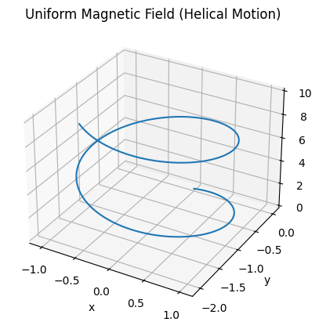
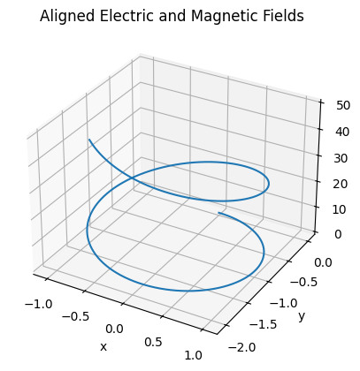
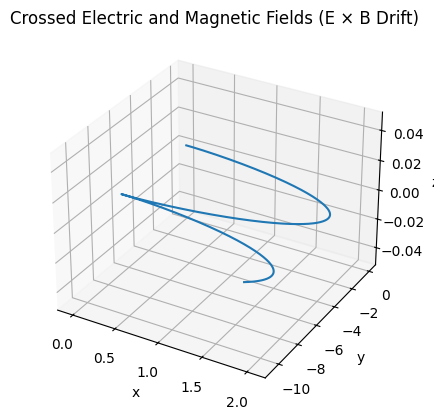

# Problem 1

# Applications of the Lorentz Force

## 1. Exploration of Applications

The **Lorentz force**, given by  
$$
\vec{F} = q(\vec{E} + \vec{v} \times \vec{B}),
$$  
describes the total force on a charged particle of charge $q$, moving with velocity $\vec{v}$ in the presence of electric $\vec{E}$ and magnetic $\vec{B}$ fields.

### Particle Accelerators

In **linear accelerators** (linacs) and **cyclotrons**, electric fields are used to accelerate particles, while magnetic fields control their trajectories.

- For particles moving perpendicular to a uniform magnetic field:  
  $$ 
  F = qvB \Rightarrow \frac{mv^2}{r} = qvB \Rightarrow r = \frac{mv}{qB}
  $$
- Radius of curvature $r$ increases with velocity $v$, thus magnetic fields provide **velocity-dependent steering**.

### Mass Spectrometers

**Mass spectrometry** relies on separating ions by their mass-to-charge ratio $\frac{m}{q}$ using the Lorentz force.

- Charged ions entering a region with $\vec{E} = 0$ and uniform $\vec{B}$ field perpendicular to velocity:  
  $$ 
  r = \frac{mv}{qB}
  $$
- With kinetic energy imparted by a known potential $V$:  
  $$
  \frac{1}{2}mv^2 = qV \Rightarrow v = \sqrt{\frac{2qV}{m}} \Rightarrow r = \frac{\sqrt{2mV}}{qB}
  $$
- Measured radius $r$ allows determination of $m/q$:
  $$
  \frac{m}{q} = \frac{r^2 B^2}{2V}
  $$

### Plasma Confinement

In **tokamaks** and **stellarators**, magnetic fields are crucial for confining high-energy plasma.

- In the absence of electric field, charged particles exhibit **helical motion** around magnetic field lines:
  $$
  \text{Gyrofrequency: } \omega_c = \frac{qB}{m}, \quad \text{Larmor radius: } r_L = \frac{mv_\perp}{qB}
  $$
- The Lorentz force prevents charged particles from escaping perpendicularly, while **toroidal magnetic fields** maintain containment.

- **E×B drift** occurs when both $\vec{E}$ and $\vec{B}$ are present:
  $$
  \vec{v}_{E \times B} = \frac{\vec{E} \times \vec{B}}{B^2}
  $$
  This drift is **independent of charge and mass**.

- **Magnetic mirrors** exploit varying $B$ field strengths:
  $$
  \mu = \frac{mv_\perp^2}{2B} = \text{constant} \Rightarrow \text{confinement via reflection at high } B
  $$

## Role of Fields in Charged Particle Motion

- **Electric fields** do work on particles:  
  $$
  \vec{F}_E = q\vec{E}, \quad W = qEd
  $$
- **Magnetic fields** alter direction, not speed:  
  $$
  \vec{F}_B = q\vec{v} \times \vec{B}, \quad \vec{v} \cdot \vec{F}_B = 0
  $$
- **Combined fields** produce complex motion:
  - Spiral/helical paths
  - Cyclotron resonance when $\omega = \omega_c$
  - Cross-field drifts critical in fusion and space physics

---
## 2. Parameter Exploration

Analyzing the effects of varying physical parameters in the Lorentz force  
$$
\vec{F} = q(\vec{E} + \vec{v} \times \vec{B})
$$  
provides insights into charged particle dynamics under controlled experimental or simulated conditions.

### Electric and Magnetic Field Strengths $(\vec{E}, \vec{B})$

- **Electric Field $\vec{E}$**:  
  Alters particle **kinetic energy** directly:
  $$
  \vec{F}_E = q\vec{E}, \quad a = \frac{q\vec{E}}{m}, \quad \Delta v = \frac{q\vec{E}}{m} \Delta t
  $$
  - Linear acceleration for uniform $\vec{E}$
  - Direction depends on the sign of $q$

- **Magnetic Field** $\vec{B}$:  
  Influences **trajectory curvature**, not speed:  
  $\vec{F}_B = q\vec{v} \times \vec{B}$, $r = \frac{mv_\perp}{qB}$, $\omega_c = \frac{qB}{m}$  
  - Stronger $B$ $\Rightarrow$ tighter curvature  
  - Direction follows right-hand rule (positive $q$)


### Initial Particle Velocity $\vec{v}$

- Magnitude of $\vec{v}$ affects both electric and magnetic interactions:
  $$
  |\vec{F}_B| = qvB \sin\theta
  $$
  - $\theta = 90^\circ$ maximizes magnetic force
  - For $\vec{v} \parallel \vec{B}$, no magnetic deflection occurs

- Particle speed $v$ determines:
  - Radius of curvature $r$
  - Helical pitch in combined $\vec{E}$ and $\vec{B}$ fields
  - Energy gained via $\vec{E}$: $K = \frac{1}{2}mv^2$

### Particle Charge and Mass $(q, m)$

- **Charge $q$**:
  - Sign affects force direction: $\vec{F} \propto q$
  - Magnitude scales force linearly:
    $$
    \vec{F} \propto q, \quad r \propto \frac{1}{q}
    $$

- **Mass $m$**:
  - Influences inertia, acceleration response:
    $$
    a = \frac{F}{m}, \quad r \propto m, \quad \omega_c \propto \frac{1}{m}
    $$

### Trajectory Response to Parameter Changes

#### Case Studies:

1. **Increase $E$**:  
   → Faster acceleration along field lines, linear velocity growth.

2. **Increase $B$**:  
   → Decreased gyro-radius $r$, increased cyclotron frequency $\omega_c$.

3. **Increase $v_\perp$**:  
   → Larger $r$, wider spiral.

4. **Switch sign of $q$**:  
   → Force vector reverses; trajectory curves in opposite direction.

5. **Increase $m$**:  
   → Slower acceleration, wider spiral path due to increased inertia.

#### Tracking Motion

Use numerical methods (e.g., Runge-Kutta) to integrate:
$$
\frac{d\vec{v}}{dt} = \frac{q}{m}(\vec{E} + \vec{v} \times \vec{B})
$$
and  
$$
\frac{d\vec{r}}{dt} = \vec{v}
$$

Trajectory sensitivity analysis is vital in:
- Plasma control
- Ion-beam focusing
- Spacecraft propulsion simulations
---

## Code and Plots

### Website with simulation
[Simulation](simul.html)

### Uniform Magnetic Field Only (Helical Motion)



```python
# Case (a): Uniform Magnetic Field Only (Helical Motion)

import numpy as np
import matplotlib.pyplot as plt
from mpl_toolkits.mplot3d import Axes3D

# Lorentz force
def lorentz_force(q, m, E, B, v):
    return (q / m) * (E + np.cross(v, B))

# Euler method
def simulate_particle(q, m, E, B, v0, r0, dt, steps):
    v = np.array(v0, dtype=float)
    r = np.array(r0, dtype=float)
    positions = [r.copy()]
    
    for _ in range(steps):
        a = lorentz_force(q, m, E, B, v)
        v += a * dt
        r += v * dt
        positions.append(r.copy())
    
    return np.array(positions)

# 3D plot
def plot_3d(positions, title='3D Trajectory'):
    fig = plt.figure()
    ax = fig.add_subplot(111, projection='3d')
    ax.plot(positions[:,0], positions[:,1], positions[:,2])
    ax.set_xlabel('x')
    ax.set_ylabel('y')
    ax.set_zlabel('z')
    ax.set_title(title)
    plt.show()

# Parameters
q = 1.0
m = 1.0
B = np.array([0, 0, 1])
E = np.array([0, 0, 0])
v0 = [1, 0, 1]
r0 = [0, 0, 0]
dt = 0.01
steps = 1000

# Run simulation
positions = simulate_particle(q, m, E, B, v0, r0, dt, steps)
plot_3d(positions, title='Uniform Magnetic Field (Helical Motion)')

```

### Aligned Electric and Magnetic Fields



```python
# Case (b): Aligned Electric and Magnetic Fields

import numpy as np
import matplotlib.pyplot as plt
from mpl_toolkits.mplot3d import Axes3D

def lorentz_force(q, m, E, B, v):
    return (q / m) * (E + np.cross(v, B))

def simulate_particle(q, m, E, B, v0, r0, dt, steps):
    v = np.array(v0, dtype=float)
    r = np.array(r0, dtype=float)
    positions = [r.copy()]
    
    for _ in range(steps):
        a = lorentz_force(q, m, E, B, v)
        v += a * dt
        r += v * dt
        positions.append(r.copy())
    
    return np.array(positions)

def plot_3d(positions, title='3D Trajectory'):
    fig = plt.figure()
    ax = fig.add_subplot(111, projection='3d')
    ax.plot(positions[:,0], positions[:,1], positions[:,2])
    ax.set_xlabel('x')
    ax.set_ylabel('y')
    ax.set_zlabel('z')
    ax.set_title(title)
    plt.show()

q = 1.0
m = 1.0
B = np.array([0, 0, 1])
E = np.array([0, 0, 1])
v0 = [1, 0, 0]
r0 = [0, 0, 0]
dt = 0.01
steps = 1000

positions = simulate_particle(q, m, E, B, v0, r0, dt, steps)
plot_3d(positions, title='Aligned Electric and Magnetic Fields')
```

### Crossed Electric and Magnetic Fields (E × B Drift)



```python 
# Case (c): Crossed Electric and Magnetic Fields (E × B Drift)

import numpy as np
import matplotlib.pyplot as plt
from mpl_toolkits.mplot3d import Axes3D

def lorentz_force(q, m, E, B, v):
    return (q / m) * (E + np.cross(v, B))

def simulate_particle(q, m, E, B, v0, r0, dt, steps):
    v = np.array(v0, dtype=float)
    r = np.array(r0, dtype=float)
    positions = [r.copy()]
    
    for _ in range(steps):
        a = lorentz_force(q, m, E, B, v)
        v += a * dt
        r += v * dt
        positions.append(r.copy())
    
    return np.array(positions)

def plot_3d(positions, title='3D Trajectory'):
    fig = plt.figure()
    ax = fig.add_subplot(111, projection='3d')
    ax.plot(positions[:,0], positions[:,1], positions[:,2])
    ax.set_xlabel('x')
    ax.set_ylabel('y')
    ax.set_zlabel('z')
    ax.set_title(title)
    plt.show()

q = 1.0
m = 1.0
B = np.array([0, 0, 1])
E = np.array([1, 0, 0])
v0 = [0, 0, 0]
r0 = [0, 0, 0]
dt = 0.01
steps = 1000

positions = simulate_particle(q, m, E, B, v0, r0, dt, steps)
plot_3d(positions, title='Crossed Electric and Magnetic Fields (E × B Drift)')

```

# Colab

[Colab](https://colab.research.google.com/drive/1a8l_nseruSh4sStYkXMmiWwOdhGdp0rF#scrollTo=ukKI_Px9WgYP)
