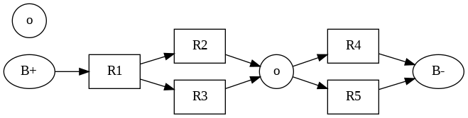
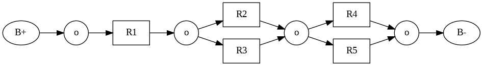
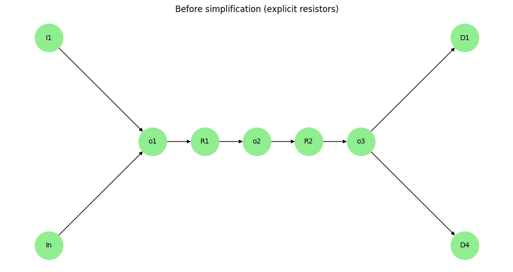
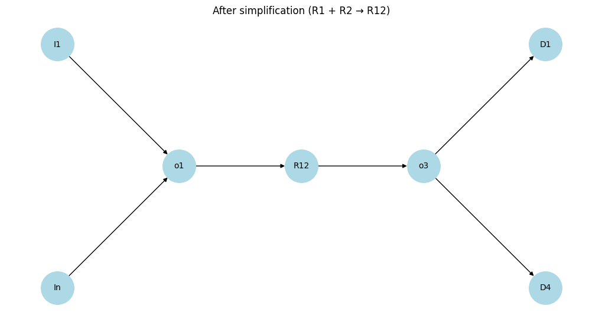
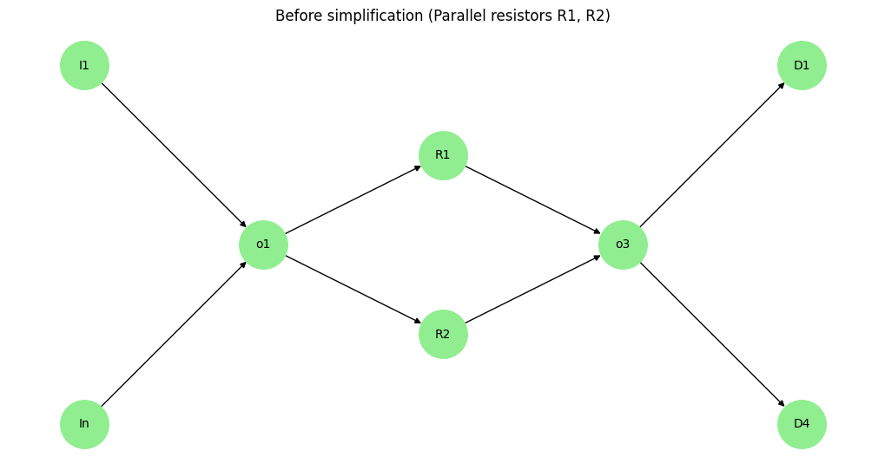
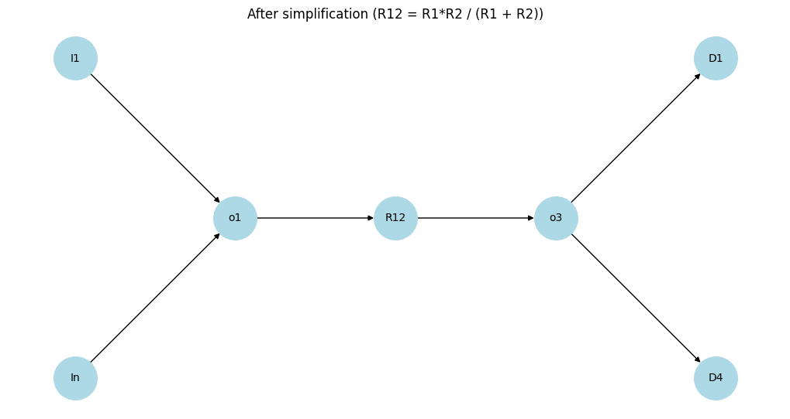

# Problem 1

# Equivalent Resistance via Graph Theory

## 1. Problem Overview

Analyzing electrical circuits using **graph theory** transforms a physical system into a mathematical model. In this approach, **nodes** represent circuit junctions, and **edges** represent resistors with associated weights (resistance values).

The central objective is to calculate the **equivalent resistance** $R_{\text{eq}}$ between two designated terminals by systematically simplifying the graph.

---

## 2. Graph-Theoretic Representation of Circuits

A resistive electrical network can be modeled as an undirected, weighted graph $G = (V, E)$ where:

- $V$ is the set of **vertices** (nodes/junctions).
- $E$ is the set of **edges** (resistors).
- Each edge $e_{ij} \in E$ connects nodes $i$ and $j$ with weight $w_{ij} = R_{ij}$, the resistance.

Types of connections:

- **Series**: Resistors along a unique path.
- **Parallel**: Resistors sharing the same pair of nodes.

---

## 3. Series and Parallel Simplification

### Series Resistance

If resistors $R_1, R_2, \dots, R_n$ are connected in series, the equivalent resistance is the sum:

$$
R_{\text{eq}} = R_1 + R_2 + \dots + R_n = \sum_{k=1}^n R_k
$$

Graph-theoretically: a path of degree-2 nodes (excluding endpoints) can be collapsed into a single edge.

### Parallel Resistance

If resistors $R_1, R_2, \dots, R_n$ are connected in parallel between two nodes:

$$
\frac{1}{R_{\text{eq}}} = \frac{1}{R_1} + \frac{1}{R_2} + \dots + \frac{1}{R_n} = \sum_{k=1}^n \frac{1}{R_k}
$$

Graph-theoretically: multiple edges between the same node pair can be merged.

---

## 4. Nested and Complex Structures

Real-world networks include nested series-parallel combinations and bridge circuits (e.g., Wheatstone bridge) that cannot be reduced by series-parallel rules alone.

Such networks may require:

- **Recursive decomposition**.
- **Cycle detection** for recognizing parallel structures.
- **Graph contraction** to reduce substructures iteratively.

---

## 5. Algorithmic Strategy

1. **Parse** input circuit into a graph: edge list or adjacency list with weights.
2. **Identify** reducible patterns:
   - Degree-2 chains (series)
   - Multiple edges or cycles (parallel)
3. **Apply** simplification rules recursively or iteratively.
4. **Repeat** until the graph reduces to a single edge representing $R_{\text{eq}}$.

---

## 6. Mathematical Tools

- **Graph contraction**: Merges nodes and aggregates edge weights.
- **DFS/BFS**: Used to identify paths, cycles, and connected components.
- **Cycle detection**: Essential for detecting non-trivial parallel paths.

---

## 7. Special Cases

### Single Resistor

Trivial case:

$$
R_{\text{eq}} = R
$$

### Empty Graph

No connection implies:

$$
R_{\text{eq}} = \infty
$$

### Disconnected Graph

If nodes are isolated, the resistance is undefined or infinite.

---

## 8. Theoretical Limitations

Series-parallel reduction fails for **non-planar graphs** or those with **non-reducible cycles**, requiring:

- **Kirchhoff's laws** or
- **Laplacian matrix** and linear algebraic methods (e.g., solving using node-voltage method).

---

## Plots

### Circuit simplification. Case 1

.gif>)

## Initial vs Simplified Resistance

We analyze the resistor network with all resistors having a value of $ 1\,\Omega $.

### Initial Resistance (Before Simplification)

Even before any reduction, the total resistance between $ B+ $ and $ B- $ is calculated as:

$$
R_{\text{initial}} = \frac{8}{3}\,\Omega \quad \text{or approximately } 2.67\,\Omega
$$

This comes from:
- $R_{23} = R_2 + R_3 = 1 + 1 = 2\,\Omega$
- $R_{45} = R_4 + R_5 = 1 + 1 = 2\,\Omega$
- $R_{123} = R_1 \parallel R_{23} = \frac{1 \cdot 2}{1 + 2} = \frac{2}{3}\,\Omega$
- $R_{\text{total}} = R_{123} + R_{45} = \frac{2}{3} + 2 = \frac{8}{3}\,\Omega$

### After Step-by-step Simplification

Each step maintains the same total resistance:
- Combine $R2$ & $R3$ → $2\,\Omega$
- Combine $R4$ & $R5$ → $2\,\Omega$
- Combine $R1$ & $R23$ in parallel → $\frac{2}{3}\,\Omega$
- Final series combination → $\frac{8}{3}\,\Omega$

### Final Result Matches Initial Value

$$
R_{\text{initial}} = R_{\text{simplified}} = \frac{8}{3}\,\Omega
$$

---

```python
import networkx as nx
import matplotlib.pyplot as plt
from PIL import Image
import os
from google.colab import files

# Create a directory to store frames
if not os.path.exists("frames"):
    os.makedirs("frames")

# Initialize the graph for the circuit
G = nx.Graph()
G.add_nodes_from(["B+", "B-", "R1", "R2", "R3", "R4", "R5"])
G.add_edges_from([("B+", "R2"), ("R2", "R3"), ("R3", "R4"), ("R4", "R5"), ("R5", "B-"), ("B+", "R1"), ("R1", "R4")])

# Define node positions for a more balanced layout
pos = {
    "B+": (0, 0),
    "R2": (1.5, 1),
    "R3": (2.5, 1),
    "R4": (3.5, 0),
    "R5": (4.5, 0),
    "B-": (6, 0),
    "R1": (2, -1)
}

# Function to draw the graph for each frame with improved styling
def draw_graph(G, pos, frame_num, highlighted_nodes=None, combined_label=None):
    plt.figure(figsize=(8, 5), facecolor='white')
    ax = plt.gca()
    ax.set_facecolor('white')

    # Define node colors and labels
    node_colors = []
    labels = {}
    for node in G.nodes():
        if highlighted_nodes and node in highlighted_nodes:
            node_colors.append("red" if frame_num == 1 else "green" if frame_num == 2 else "cyan" if frame_num == 3 else "purple")
        else:
            node_colors.append("lightgray")
        labels[node] = node if node not in ["B+", "B-"] else f"{node[:-1]}{node[-1]}"
        if combined_label and node in highlighted_nodes:
            labels[node] = combined_label

    # Draw the graph with enhanced styling
    nx.draw_networkx_nodes(G, pos, node_color=node_colors, node_size=1200, node_shape='s', edgecolors='black', linewidths=1.5)
    nx.draw_networkx_edges(G, pos, width=2, edge_color='gray', arrows=True, arrowsize=15)
    nx.draw_networkx_labels(G, pos, labels=labels, font_size=12, font_weight="bold", font_family="sans-serif")

    # Add a styled title
    plt.title(f"Step {frame_num + 1}", fontsize=16, fontweight='bold', pad=20, loc='left')
    plt.axis('off')  # Hide axes for a cleaner look
    plt.savefig(f"frames/frame_{frame_num}.png", bbox_inches="tight", dpi=100)
    plt.close()

# List to store frames
frames = []

# Frame 0: Initial circuit
draw_graph(G, pos, 0)
frames.append(Image.open(f"frames/frame_0.png"))

# Frame 1: Combine R2 and R3 into R23
G_combined1 = G.copy()
G_combined1 = nx.contracted_nodes(G_combined1, "R2", "R3", self_loops=False)
G_combined1 = nx.relabel_nodes(G_combined1, {"R2": "R23"})
pos["R23"] = ((pos["R2"][0] + pos["R3"][0]) / 2, (pos["R2"][1] + pos["R3"][1]) / 2)
draw_graph(G_combined1, pos, 1, highlighted_nodes=["R23"], combined_label="R23")
frames.append(Image.open(f"frames/frame_1.png"))

# Frame 2: Combine R4 and R5 into R45
G_combined2 = G_combined1.copy()
G_combined2 = nx.contracted_nodes(G_combined2, "R4", "R5", self_loops=False)
G_combined2 = nx.relabel_nodes(G_combined2, {"R4": "R45"})
pos["R45"] = ((pos["R4"][0] + pos["R5"][0]) / 2, (pos["R4"][1] + pos["R5"][1]) / 2)
draw_graph(G_combined2, pos, 2, highlighted_nodes=["R45"], combined_label="R45")
frames.append(Image.open(f"frames/frame_2.png"))

# Frame 3: Combine R1 and R23 into R123
G_combined3 = G_combined2.copy()
G_combined3 = nx.contracted_nodes(G_combined3, "R1", "R23", self_loops=False)
G_combined3 = nx.relabel_nodes(G_combined3, {"R1": "R123"})
pos["R123"] = ((pos["R1"][0] + pos["R23"][0]) / 2, (pos["R1"][1] + pos["R23"][1]) / 2)
draw_graph(G_combined3, pos, 3, highlighted_nodes=["R123"], combined_label="R123")
frames.append(Image.open(f"frames/frame_3.png"))

# Frame 4: Combine R123 and R45 into R12345
G_combined4 = G_combined3.copy()
G_combined4 = nx.contracted_nodes(G_combined4, "R123", "R45", self_loops=False)
G_combined4 = nx.relabel_nodes(G_combined4, {"R123": "R12345"})
pos["R12345"] = ((pos["R123"][0] + pos["R45"][0]) / 2, (pos["R123"][1] + pos["R45"][1]) / 2)
draw_graph(G_combined4, pos, 4, highlighted_nodes=["R12345"], combined_label="R12345")
frames.append(Image.open(f"frames/frame_4.png"))

# Save frames as a GIF
frames[0].save("circuit_simplification_case1.gif", save_all=True, append_images=frames[1:], duration=1000, loop=0)

# Download the GIF
files.download("circuit_simplification_case1.gif")

# Clean up frames directory
import shutil
shutil.rmtree("frames")
```

---

### Case 2

#### Step 1



---

#### Step 2



---

#### Step 3


```python
from graphviz import Digraph

# 1. Початкова схема
dot1 = Digraph(comment='Initial')
dot1.attr(rankdir='LR')

dot1.node('B+', 'B+')
dot1.node('R1', 'R1', shape='box')
dot1.node('R2', 'R2', shape='box')
dot1.node('R3', 'R3', shape='box')
dot1.node('R4', 'R4', shape='box')
dot1.node('R5', 'R5', shape='box')
dot1.node('O1', 'o', shape='circle')
dot1.node('O2', 'o', shape='circle')
dot1.node('B-', 'B-')

dot1.edges([('B+', 'R1'), ('R1', 'R2'), ('R1', 'R3'),
            ('R2', 'O1'), ('R3', 'O1'), ('O1', 'R4'), ('O1', 'R5'),
            ('R4', 'B-'), ('R5', 'B-')])

# 2. Удосконалена схема (з додатковими вузлами o)
dot2 = Digraph(comment='More consistent')
dot2.attr(rankdir='LR')

dot2.node('B+', 'B+')
dot2.node('O0', 'o', shape='circle')
dot2.node('R1', 'R1', shape='box')
dot2.node('O1', 'o', shape='circle')
dot2.node('R2', 'R2', shape='box')
dot2.node('R3', 'R3', shape='box')
dot2.node('O2', 'o', shape='circle')
dot2.node('R4', 'R4', shape='box')
dot2.node('R5', 'R5', shape='box')
dot2.node('O3', 'o', shape='circle')
dot2.node('B-', 'B-')

dot2.edges([('B+', 'O0'), ('O0', 'R1'), ('R1', 'O1'),
            ('O1', 'R2'), ('O1', 'R3'),
            ('R2', 'O2'), ('R3', 'O2'),
            ('O2', 'R4'), ('O2', 'R5'),
            ('R4', 'O3'), ('R5', 'O3'), ('O3', 'B-')])

# 3. Спрощена графова схема (резистори — це ребра)
dot3 = Digraph(comment='Resistors as edges')
dot3.attr(rankdir='LR')

dot3.node('B+', 'B+')
dot3.node('O0', 'o', shape='circle')
dot3.node('O1', 'o', shape='circle')
dot3.node('O2', 'o', shape='circle')
dot3.node('O3', 'o', shape='circle')  # Додано останній вузол "o"
dot3.node('B-', 'B-')

dot3.edge('B+', 'O0')
dot3.edge('O0', 'O1', label='R1')
dot3.edge('O1', 'O2', label='R2')
dot3.edge('O1', 'O2', label='R3')
dot3.edge('O2', 'O3', label='R4')
dot3.edge('O2', 'O3', label='R5')
dot3.edge('O3', 'B-',)

# Вивід схем
dot1.render('initial_scheme', format='png', cleanup=False)
dot2.render('consistent_scheme', format='png', cleanup=False)
dot3.render('simplified_scheme', format='png', cleanup=False)

```

---

## Building blocks

### Series confugiration 



### Can be replaced by



```python
import networkx as nx
import matplotlib.pyplot as plt

# === ГРАФ до спрощення ===
G = nx.DiGraph()  # напрямлений для точності

# Вузли: вхідні, вихідні, опори, з'єднувальні
G.add_nodes_from(['I1', 'In', 'o1', 'o2', 'o3', 'R1', 'R2', 'D1', 'D4'])

# З'єднання
G.add_edge('I1', 'o1')
G.add_edge('In', 'o1')
G.add_edge('o1', 'R1')
G.add_edge('R1', 'o2')
G.add_edge('o2', 'R2')
G.add_edge('R2', 'o3')
G.add_edge('o3', 'D1')
G.add_edge('o3', 'D4')

# Позиції для кращої візуалізації
pos = {
    'I1': (-2, 1), 'In': (-2, -1),
    'o1': (-1, 0), 'R1': (-0.5, 0), 'o2': (0, 0),
    'R2': (0.5, 0), 'o3': (1, 0),
    'D1': (2, 1), 'D4': (2, -1)
}

# Малюємо початкову схему
plt.figure(figsize=(10, 5))
nx.draw(G, pos, with_labels=True, node_color='lightgreen', node_size=1600, font_size=10)
plt.title("Before simplification (explicit resistors)")
plt.show()

# === СПРОЩЕННЯ: заміна R1, R2 та o2 на один резистор R12 ===
# Створюємо новий граф
G2 = nx.DiGraph()
G2.add_nodes_from(['I1', 'In', 'o1', 'R12', 'o3', 'D1', 'D4'])

G2.add_edge('I1', 'o1')
G2.add_edge('In', 'o1')
G2.add_edge('o1', 'R12')
G2.add_edge('R12', 'o3')
G2.add_edge('o3', 'D1')
G2.add_edge('o3', 'D4')

# Оновлені позиції
pos2 = {
    'I1': (-2, 1), 'In': (-2, -1),
    'o1': (-1, 0), 'R12': (0, 0), 'o3': (1, 0),
    'D1': (2, 1), 'D4': (2, -1)
}

# Малюємо спрощену схему
plt.figure(figsize=(10, 5))
nx.draw(G2, pos2, with_labels=True, node_color='lightblue', node_size=1600, font_size=10)
plt.title("After simplification (R1 + R2 → R12)")
plt.show()
```


---

## Parallel configuration



### Can be replaced by 



```python
import networkx as nx
import matplotlib.pyplot as plt

# === ГРАФ ДО СПРОЩЕННЯ ===
G = nx.DiGraph()

# Вузли
G.add_nodes_from(['I1', 'In', 'o1', 'R1', 'R2', 'o3', 'D1', 'D4'])

# Зв'язки
G.add_edge('I1', 'o1')
G.add_edge('In', 'o1')
G.add_edge('o1', 'R1')
G.add_edge('R1', 'o3')
G.add_edge('o1', 'R2')
G.add_edge('R2', 'o3')
G.add_edge('o3', 'D1')
G.add_edge('o3', 'D4')

# Позиції
pos = {
    'I1': (-2, 1), 'In': (-2, -1),
    'o1': (-1, 0),
    'R1': (0, 0.5), 'R2': (0, -0.5),
    'o3': (1, 0),
    'D1': (2, 1), 'D4': (2, -1)
}

# Малюнок до спрощення
plt.figure(figsize=(10, 5))
nx.draw(G, pos, with_labels=True, node_color='lightgreen', node_size=1600, font_size=10)
plt.title("Before simplification (Parallel resistors R1, R2)")
plt.show()

# === СПРОЩЕНА СХЕМА ===
G2 = nx.DiGraph()
G2.add_nodes_from(['I1', 'In', 'o1', 'R12', 'o3', 'D1', 'D4'])

G2.add_edge('I1', 'o1')
G2.add_edge('In', 'o1')
G2.add_edge('o1', 'R12')
G2.add_edge('R12', 'o3')
G2.add_edge('o3', 'D1')
G2.add_edge('o3', 'D4')

# Позиції
pos2 = {
    'I1': (-2, 1), 'In': (-2, -1),
    'o1': (-1, 0),
    'R12': (0, 0), 'o3': (1, 0),
    'D1': (2, 1), 'D4': (2, -1)
}

# Малюнок після спрощення
plt.figure(figsize=(10, 5))
nx.draw(G2, pos2, with_labels=True, node_color='lightblue', node_size=1600, font_size=10)
plt.title("After simplification (R12 = R1*R2 / (R1 + R2))")
plt.show()

```

# Colab

[Colab](https://colab.research.google.com/drive/1UutbWrSg6P2xB9VMp_JO6K1IljovDN2J#scrollTo=gVN37zBlC4BT)

