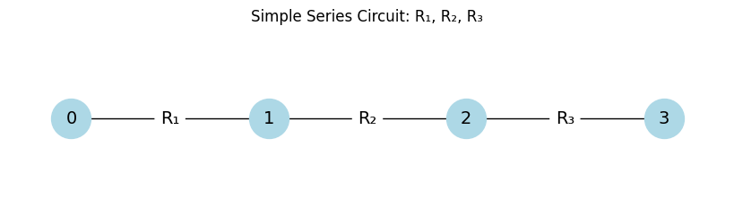
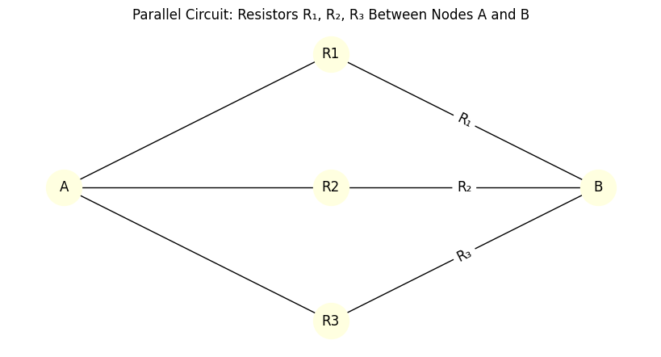
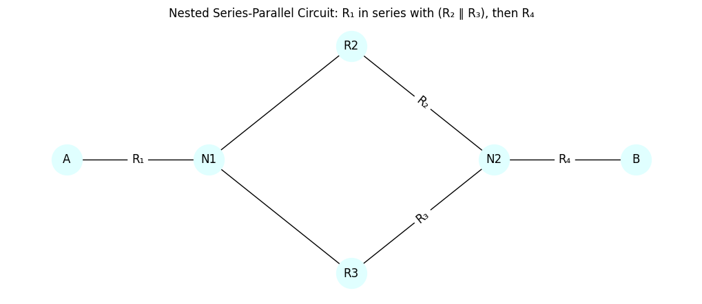
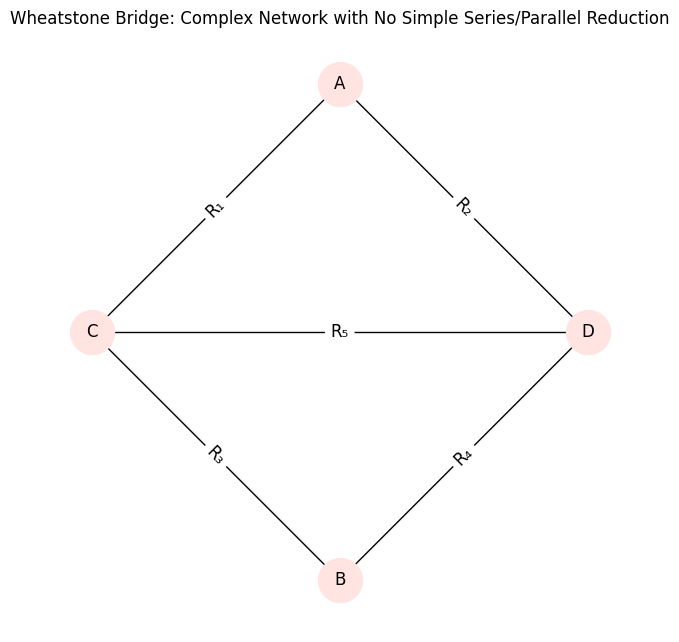

# Problem 1

# Equivalent Resistance via Graph Theory

## 1. Problem Overview

Analyzing electrical circuits using **graph theory** transforms a physical system into a mathematical model. In this approach, **nodes** represent circuit junctions, and **edges** represent resistors with associated weights (resistance values).

The central objective is to calculate the **equivalent resistance** $R_{\text{eq}}$ between two designated terminals by systematically simplifying the graph.

---

## 2. Graph-Theoretic Representation of Circuits

A resistive electrical network can be modeled as an undirected, weighted graph $G = (V, E)$ where:

- $V$ is the set of **vertices** (nodes/junctions).
- $E$ is the set of **edges** (resistors).
- Each edge $e_{ij} \in E$ connects nodes $i$ and $j$ with weight $w_{ij} = R_{ij}$, the resistance.

Types of connections:

- **Series**: Resistors along a unique path.
- **Parallel**: Resistors sharing the same pair of nodes.

---

## 3. Series and Parallel Simplification

### Series Resistance

If resistors $R_1, R_2, \dots, R_n$ are connected in series, the equivalent resistance is the sum:

$$
R_{\text{eq}} = R_1 + R_2 + \dots + R_n = \sum_{k=1}^n R_k
$$

Graph-theoretically: a path of degree-2 nodes (excluding endpoints) can be collapsed into a single edge.

### Parallel Resistance

If resistors $R_1, R_2, \dots, R_n$ are connected in parallel between two nodes:

$$
\frac{1}{R_{\text{eq}}} = \frac{1}{R_1} + \frac{1}{R_2} + \dots + \frac{1}{R_n} = \sum_{k=1}^n \frac{1}{R_k}
$$

Graph-theoretically: multiple edges between the same node pair can be merged.

---

## 4. Nested and Complex Structures

Real-world networks include nested series-parallel combinations and bridge circuits (e.g., Wheatstone bridge) that cannot be reduced by series-parallel rules alone.

Such networks may require:

- **Recursive decomposition**.
- **Cycle detection** for recognizing parallel structures.
- **Graph contraction** to reduce substructures iteratively.

---

## 5. Algorithmic Strategy

1. **Parse** input circuit into a graph: edge list or adjacency list with weights.
2. **Identify** reducible patterns:
   - Degree-2 chains (series)
   - Multiple edges or cycles (parallel)
3. **Apply** simplification rules recursively or iteratively.
4. **Repeat** until the graph reduces to a single edge representing $R_{\text{eq}}$.

---

## 6. Mathematical Tools

- **Graph contraction**: Merges nodes and aggregates edge weights.
- **DFS/BFS**: Used to identify paths, cycles, and connected components.
- **Cycle detection**: Essential for detecting non-trivial parallel paths.

---

## 7. Special Cases

### Single Resistor

Trivial case:

$$
R_{\text{eq}} = R
$$

### Empty Graph

No connection implies:

$$
R_{\text{eq}} = \infty
$$

### Disconnected Graph

If nodes are isolated, the resistance is undefined or infinite.

---

## 8. Theoretical Limitations

Series-parallel reduction fails for **non-planar graphs** or those with **non-reducible cycles**, requiring:

- **Kirchhoff's laws** or
- **Laplacian matrix** and linear algebraic methods (e.g., solving using node-voltage method).

---

## Plots

### Simple Series Circuit

### Simple Parallel Circuit

### Nested Series-Parallel Circuit

### Complex Network (e.g., Wheatstone Bridge)

---

# Colab

[Colab](https://colab.research.google.com/drive/1UutbWrSg6P2xB9VMp_JO6K1IljovDN2J#scrollTo=gVN37zBlC4BT)

