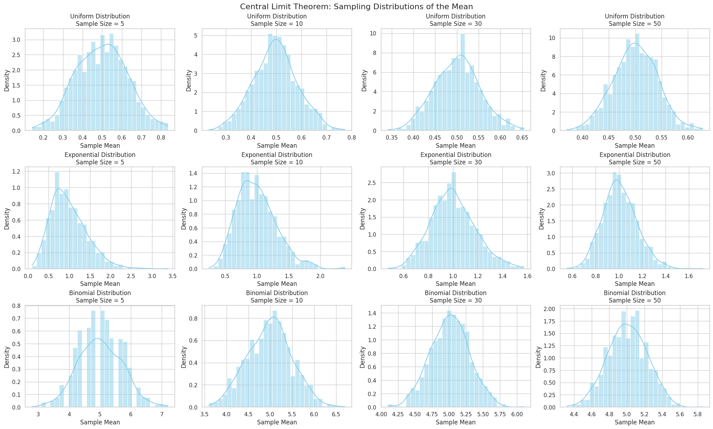

# Problem 1

# Central Limit Theorem Simulation – Theoretical Foundations

## Introduction

The **Central Limit Theorem (CLT)** is a cornerstone of probability theory and statistics. It establishes that, regardless of the population distribution's shape, the distribution of the sample mean approximates a normal distribution as the sample size increases, provided that certain conditions are met.

## Central Limit Theorem – Formal Statement

Let $X_1, X_2, \dots, X_n$ be a sequence of independent and identically distributed (i.i.d.) random variables with finite mean $\mu$ and finite variance $\sigma^2$. The sample mean $\bar{X}_n$ is given by:

$$
\bar{X}_n = \frac{1}{n} \sum_{i=1}^{n} X_i
$$

Then, as $n \to \infty$, the standardized version of $\bar{X}_n$ converges in distribution to a standard normal variable $Z$:

$$
Z = \frac{\bar{X}_n - \mu}{\sigma / \sqrt{n}} \xrightarrow{d} \mathcal{N}(0, 1)
$$

This convergence allows practitioners to approximate probabilities concerning the sample mean using the standard normal distribution.

## Conditions for the CLT

The convergence described by the CLT holds under the following assumptions:

- The samples must be independent.
- Each sample must be drawn from the same distribution (i.i.d.).
- The population distribution must have a finite variance $\sigma^2 < \infty$.

## Implications and Applications

The CLT has wide-ranging implications in both theoretical and applied statistics:

- **Estimation**: Enables construction of confidence intervals for population means.
- **Hypothesis Testing**: Justifies the use of z-tests and t-tests under large sample sizes.
- **Quality Control**: Supports assumptions in control charts where process means are monitored.
- **Financial Modeling**: Underpins stochastic models that assume normality for asset returns over time.

## Role of Sample Size and Population Shape

As the sample size $n$ increases:

- The **distribution of sample means** becomes increasingly symmetric and bell-shaped.
- The **standard error** of the sample mean $\sigma / \sqrt{n}$ decreases, leading to more concentrated distributions.
- Even for skewed or discrete distributions, the sampling distribution of the mean tends toward normality.

Importantly, the rate of convergence to normality is faster when:

- The original population is already symmetric (e.g., uniform).
- The sample size is larger (commonly, $n \geq 30$ is sufficient).

## Population Variance and Spread of Sampling Distribution

The **spread** of the sampling distribution of the mean is determined by the **population standard deviation $\sigma$** and the **sample size $n$**:

$$
\text{Standard Error} = \frac{\sigma}{\sqrt{n}}
$$

Thus, greater population variability requires larger sample sizes to achieve the same level of precision in the sample mean.

## Simulation Rationale

Through simulation, we empirically verify:

- How distributions of sample means converge to normality.
- The influence of sample size and population type (Uniform, Exponential, Binomial).
- How increasing sample size reduces sampling variability.

These empirical findings provide tangible support for the theoretical guarantees of the CLT.

## Code and Plots

## Central Limit Theorem: Sampling Distributions of the Mean



```python
# CLT Simulation in Colab

import numpy as np
import matplotlib.pyplot as plt
import seaborn as sns

# Set plot style
sns.set(style="whitegrid")
np.random.seed(42)

# Parameters
distributions = {
    'Uniform': lambda size: np.random.uniform(0, 1, size),
    'Exponential': lambda size: np.random.exponential(scale=1.0, size=size),
    'Binomial': lambda size: np.random.binomial(n=10, p=0.5, size=size),
}
sample_sizes = [5, 10, 30, 50]
num_samples = 1000  # Number of times to sample to form sampling distribution

# Plotting
fig, axes = plt.subplots(
    len(distributions), len(sample_sizes), 
    figsize=(20, 12), 
    constrained_layout=True
)

for i, (dist_name, dist_func) in enumerate(distributions.items()):
    for j, n in enumerate(sample_sizes):
        sample_means = [
            np.mean(dist_func(n)) for _ in range(num_samples)
        ]

        ax = axes[i, j]
        sns.histplot(sample_means, kde=True, stat="density", bins=30, ax=ax, color='skyblue')
        ax.set_title(f'{dist_name} Distribution\nSample Size = {n}', fontsize=12)
        ax.set_xlabel('Sample Mean')
        ax.set_ylabel('Density')

plt.suptitle("Central Limit Theorem: Sampling Distributions of the Mean", fontsize=16)
plt.show()
```

---

# Colab

[Colab](https://colab.research.google.com/drive/1Pl3rwMcWLpNtIH0ayPh-nkp3iLcZFDb4)

