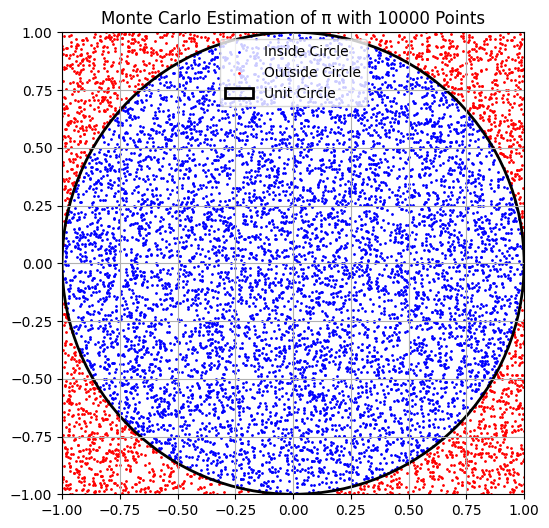
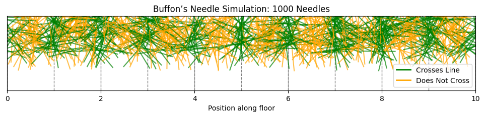

# Problem 2

# Estimating π: Theoretical Foundations

## Part 1: Estimating π Using a Circle (Monte Carlo Method)

### 1.1 Geometric Probability Concept

To estimate π geometrically, we consider a unit circle inscribed in a square. The approach uses the idea of geometric probability — the probability of a random point falling inside the circle is proportional to the ratio of the circle's area to the square's area.

- Define a square of side length 2, centered at the origin: $x, y \in [-1, 1]$.
- The inscribed circle has a radius $r = 1$ and is centered at the origin.

The area of the square is:
$$
A_{\text{square}} = 2 \times 2 = 4
$$

The area of the circle is:
$$
A_{\text{circle}} = \pi r^2 = \pi \cdot 1^2 = \pi
$$

Thus, the probability $P$ that a randomly chosen point $(x, y)$ falls inside the circle is:
$$
P = \frac{A_{\text{circle}}}{A_{\text{square}}} = \frac{\pi}{4}
$$

This leads to the approximation:
$$
\pi \approx 4 \cdot \frac{\text{Number of points inside circle}}{\text{Total number of points}}
$$

### 1.2 Estimation Logic

We simulate $N$ random points in the square. A point lies inside the circle if:
$$
x^2 + y^2 \leq 1
$$

Let $M$ be the number of points satisfying the condition above. Then:
$$
\pi \approx 4 \cdot \frac{M}{N}
$$

---

## Part 2: Estimating π Using Buffon’s Needle

### 2.1 Problem Description

Buffon’s Needle is a classic probabilistic experiment proposed by Georges-Louis Leclerc, Comte de Buffon, in the 18th century. It estimates π based on the probability of a needle crossing lines on a plane.

#### Setup:

- Draw parallel horizontal lines spaced $d$ units apart.
- Drop a needle of length $l$ ($l \leq d$) onto the plane.

Let:
- $\theta$ be the acute angle between the needle and the lines: $\theta \in [0, \pi]$
- $x$ be the distance from the center of the needle to the nearest line: $x \in [0, \frac{d}{2}]$

A crossing occurs if:
$$
x \leq \frac{l}{2} \sin \theta
$$

### 2.2 Derivation of the Formula

The probability $P$ of the needle crossing a line is:
$$
P = \frac{2l}{\pi d}
$$

Solving for $\pi$ gives:
$$
\pi \approx \frac{2l \cdot N}{d \cdot C}
$$

Where:
- $N$ is the total number of throws
- $C$ is the number of crossings

### 2.3 Conditions for Validity

- $l \leq d$
- Random uniform distribution of both $x$ and $\theta$
- Sufficiently large number of trials for convergence

---

## Code and Plots

### For Part 1: Circle-Based Estimation



#### Estimated π ≈ 3.120800

```python
import numpy as np
import matplotlib.pyplot as plt

# Set number of random points
N = 10000

# Generate random points (x, y) in the square [-1, 1] x [-1, 1]
x = np.random.uniform(-1, 1, N)
y = np.random.uniform(-1, 1, N)

# Determine whether each point is inside the unit circle
inside_circle = x**2 + y**2 <= 1

# Estimate π
pi_estimate = 4 * np.sum(inside_circle) / N
print(f"Estimated π ≈ {pi_estimate:.6f}")

# Plotting
fig, ax = plt.subplots(figsize=(6, 6))
ax.set_aspect('equal')
ax.set_title(f'Monte Carlo Estimation of π with {N} Points')

# Plot points
ax.scatter(x[inside_circle], y[inside_circle], color='blue', s=1, label='Inside Circle')
ax.scatter(x[~inside_circle], y[~inside_circle], color='red', s=1, label='Outside Circle')

# Draw unit circle and square
circle = plt.Circle((0, 0), 1, color='black', fill=False, linewidth=2, label='Unit Circle')
ax.add_artist(circle)
ax.set_xlim([-1, 1])
ax.set_ylim([-1, 1])
ax.legend()
plt.grid(True)
plt.show()

```
---

### For Part 2: Buffon’s Needle Estimation



#### Estimated π ≈ 3.143561

```python
import numpy as np
import matplotlib.pyplot as plt

# Simulation parameters
needle_length = 0.8
line_spacing = 1.0
num_needles = 100000  # For π estimation
num_needles_vis = 1000  # For visualization
num_lines = 10
num_runs = 10  # Multiple runs for averaging

# Function to simulate one run
def buffon_needle_simulation(num_needles):
    # Generate random centers and angles
    x_center = np.random.uniform(0, num_lines * line_spacing, num_needles)
    theta = np.random.uniform(0, np.pi, num_needles)
    
    # Calculate needle endpoints
    dx = (needle_length / 2) * np.cos(theta)
    dy = (needle_length / 2) * np.sin(theta)
    x1 = x_center - dx
    x2 = x_center + dx
    
    # Check for crossings: a needle crosses if its endpoints lie on opposite sides of a line
    crosses_line = np.zeros(num_needles, dtype=bool)
    for i in range(num_needles):
        line_left = np.floor(x1[i] / line_spacing) * line_spacing
        line_right = np.floor(x2[i] / line_spacing) * line_spacing
        crosses_line[i] = line_left != line_right
    
    return np.sum(crosses_line)

# Run simulation multiple times
crossings_total = 0
for _ in range(num_runs):
    crossings_total += buffon_needle_simulation(num_needles)
crossings_avg = crossings_total / num_runs

# Estimate π
if crossings_avg > 0:
    pi_estimate = (2 * needle_length * num_needles) / (line_spacing * crossings_avg)
    print(f"Estimated π ≈ {pi_estimate:.6f} (averaged over {num_runs} runs)")
else:
    print("No crossings occurred. Try increasing the number of needles.")

# Visualization (using fewer needles for clarity)
x_center = np.random.uniform(0, num_lines * line_spacing, num_needles_vis)
theta = np.random.uniform(0, np.pi, num_needles_vis)
dx = (needle_length / 2) * np.cos(theta)
dy = (needle_length / 2) * np.sin(theta)
x1 = x_center - dx
x2 = x_center + dx
y_center = np.random.uniform(0, needle_length, num_needles_vis)  # Random y for visualization

# Determine crossings for visualization
crosses_line = np.zeros(num_needles_vis, dtype=bool)
for i in range(num_needles_vis):
    line_left = np.floor(x1[i] / line_spacing) * line_spacing
    line_right = np.floor(x2[i] / line_spacing) * line_spacing
    crosses_line[i] = line_left != line_right

# Plotting
fig, ax = plt.subplots(figsize=(12, 6))
ax.set_title(f"Buffon’s Needle Simulation: {num_needles_vis} Needles")
ax.set_xlim(0, num_lines * line_spacing)
ax.set_ylim(-needle_length, needle_length)

# Draw parallel lines
for i in range(num_lines + 1):
    ax.axvline(i * line_spacing, color='gray', linestyle='--', linewidth=1)

# Plot needles
for i in range(num_needles_vis):
    color = 'green' if crosses_line[i] else 'orange'
    ax.plot([x1[i], x2[i]], [y_center[i] - dy[i], y_center[i] + dy[i]], color=color, alpha=0.7)

ax.set_aspect('equal')
ax.set_yticks([])
ax.set_xlabel('Position along floor')
plt.legend(handles=[
    plt.Line2D([0], [0], color='green', lw=2, label='Crosses Line'),
    plt.Line2D([0], [0], color='orange', lw=2, label='Does Not Cross')
])
plt.grid(True)
plt.show()
```


# Colab

[Colab](https://colab.research.google.com/drive/18_HYcI-srm95C2dQ0X7dBWglupLPsHEt)

