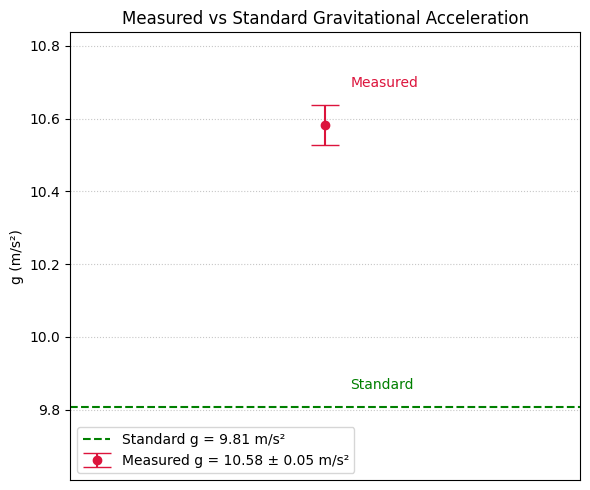

# Problem 1

# Measuring Earth's Gravitational Acceleration with a Pendulum

## Motivation

The acceleration due to gravity, denoted as $g$, is a fundamental physical constant. One classical method to estimate $g$ is by analyzing the period of a simple pendulum. This experiment emphasizes proper measurement and uncertainty analysis.

---

## Materials

- String length: approx. 1–1.5 m
- Small weight (e.g., phone charger block)
- Stopwatch or smartphone timer
- Ruler or tape measure (resolution: **1 cm**)

---

## Setup

- Measured pendulum length:  
  $$ L = 1.53 \, \text{m} \quad \pm \quad \Delta L = 0.005 \, \text{m} $$  
  (Uncertainty: half the smallest unit of your ruler)

---

## Data Collection

| Trial | Time for 10 Oscillations $t_{10}$ (s) |
|-------|----------------------------------------|
| 1     | 23.90                                  |
| 2     | 23.80                                  |
| 3     | 23.70                                  |
| 4     | 23.77                                  |
| 5     | 24.01                                  |
| 6     | 24.04                                  |
| 7     | 23.70                                  |
| 8     | 24.07                                  |
| 9     | 24.09                                  |
| 10    | 23.83                                  |

- Mean time:  
  $$ \overline{t_{10}} = 23.891 \, \text{s} $$

- Standard deviation:  
  $$ s = 0.157 \, \text{s} $$

- Uncertainty in mean time:  
  $$ \Delta \overline{t_{10}} = \frac{0.157}{\sqrt{10}} = 0.050 \, \text{s} $$

---

## Calculations

- Period of pendulum:  
  $$ T = \frac{\overline{t_{10}}}{10} = \frac{23.891}{10} = 2.389 \, \text{s} $$

- Gravitational acceleration:  
  $$ g = \frac{4\pi^2 \cdot 1.53}{(2.389)^2} = 10.60 \, \text{m/s}^2 $$

---

## Uncertainty Propagation

- Uncertainty in $T$:  
  $$ \Delta T = \frac{\Delta \overline{t_{10}}}{10} = \frac{0.050}{10} = 0.005 \, \text{s} $$

- Relative uncertainty:  
  $$
  \frac{\Delta g}{g} = \sqrt{ \left( \frac{0.005}{1.53} \right)^2 + \left( 2 \cdot \frac{0.005}{2.389} \right)^2 } = 0.00428
  $$

- Then:  
  $$ \Delta g = 10.60 \cdot 0.00428 = 0.045 \, \text{m/s}^2 $$

- Final result:  
  $$ g = 10.60 \pm 0.05 \, \text{m/s}^2 $$

---

## Code and Plot



```python
import numpy as np
import matplotlib.pyplot as plt

# --- Data ---
t10_values = np.array([23.90, 23.80, 23.70, 23.77, 24.01, 24.04, 23.70, 24.07, 24.09, 23.83])
L = 1.53  # Length of the pendulum in meters
delta_L = 0.005  # Uncertainty in length (assumed to be 0.5 cm)
n = len(t10_values)  # Number of trials

# --- Calculations ---
# Mean time for 10 oscillations
mean_t10 = np.mean(t10_values)

# Standard deviation and uncertainty in mean time
std_t10 = np.std(t10_values, ddof=1)
uncertainty_t10 = std_t10 / np.sqrt(n)

# Period and its uncertainty
T = mean_t10 / 10
delta_T = uncertainty_t10 / 10

# Gravitational acceleration
g = (4 * np.pi**2 * L) / T**2

# Uncertainty in g using propagation of errors
relative_uncertainty_g = np.sqrt((delta_L / L)**2 + (2 * delta_T / T)**2)
delta_g = g * relative_uncertainty_g

# Standard gravitational acceleration value
g_standard = 9.80665

# --- Print results ---
print(f"Measured g = {g:.2f} ± {delta_g:.2f} m/s²")

# --- Plot: Measured g vs Standard g ---
plt.figure(figsize=(6, 5))

# Dynamic y-limits for clarity
y_min = min(g - delta_g, g_standard) - 0.2
y_max = max(g + delta_g, g_standard) + 0.2

# Plot measured g with error bars
plt.errorbar(1, g, yerr=delta_g, fmt='o', capsize=10, color='crimson',
             label=f'Measured g = {g:.2f} ± {delta_g:.2f} m/s²')

# Plot standard g
plt.hlines(g_standard, 0.5, 1.5, colors='green', linestyles='--',
           label=f'Standard g = {g_standard:.2f} m/s²')

# Annotate points
plt.text(1.05, g + delta_g + 0.05, "Measured", color='crimson')
plt.text(1.05, g_standard + 0.05, "Standard", color='green')

# Format axes
plt.xticks([])
plt.xlim(0.5, 1.5)
plt.ylim(y_min, y_max)
plt.ylabel('g (m/s²)')
plt.title('Measured vs Standard Gravitational Acceleration')
plt.grid(True, linestyle=':', alpha=0.7)
plt.legend()
plt.tight_layout()

# Show the plot
plt.show()

```
---

## Analysis

1. **Comparison with standard value**:  
   - Standard $g = 9.80665 \, \text{m/s}^2$  
   - Difference: $\Delta = 10.60 - 9.81 = 0.79 \, \text{m/s}^2$

2. **Discussion**:
   - Measurement resolution introduces small uncertainty, but most error likely from timing reaction.
   - Repeated measurements reduced random error.
   - Assumes small-angle approximation and ideal point mass, which may not fully apply.


# Colab

[Colab](https://colab.research.google.com/drive/1DbQq2enmSWr-EJ-sfECsZJF_DLwxeM51#scrollTo=3yaOyweqSoFX)

