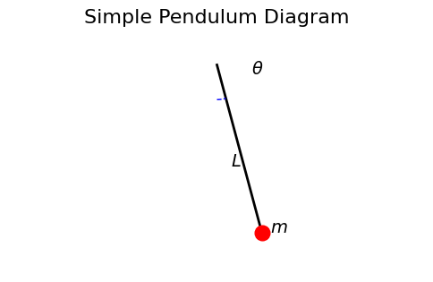
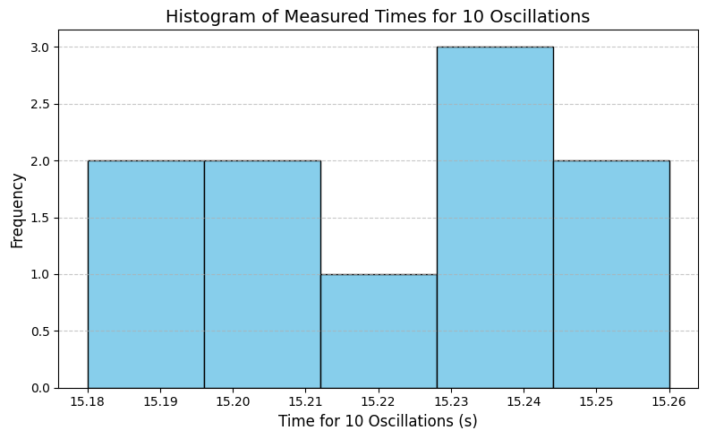
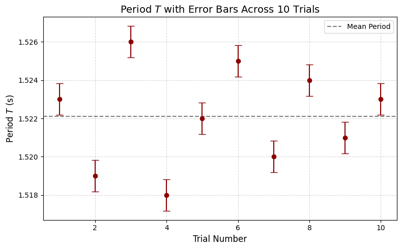
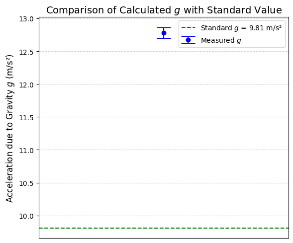

# Problem 1

# Theoretical Background

## Simple Pendulum Motion

A simple pendulum consists of a point mass suspended from a fixed point by a string of negligible mass and inextensible length. When displaced and released, it oscillates under the influence of gravity.

The motion is approximately simple harmonic if the angular displacement is small (typically less than 15°), ensuring the approximation:

$$
\sin(\theta) \approx \theta \quad \text{(in radians)}
$$

This leads to the equation of motion:

$$
\frac{d^2\theta}{dt^2} + \frac{g}{L}\theta = 0
$$

where:
- $g$ is the acceleration due to gravity,
- $L$ is the length of the pendulum,
- $\theta$ is the angular displacement.

The solution is harmonic with period:

$$
T = 2\pi \sqrt{\frac{L}{g}}
$$

Solving for $g$ gives:

$$
g = \frac{4\pi^2 L}{T^2}
$$

## Measurement and Uncertainty

### Length Measurement

Let:
- $L$ be the measured length,
- $\Delta L$ be the uncertainty in length, estimated as half the resolution of the measuring tool.

If the resolution is $r$:

$$
\Delta L = \frac{r}{2}
$$

### Time Measurement

For accurate determination of the period, we measure the time $t_{10}$ for 10 complete oscillations, then calculate the mean time $\bar{t}_{10}$ and standard deviation $\sigma_{10}$ over $n = 10$ trials.

Period:

$$
T = \frac{\bar{t}_{10}}{10}
$$

Uncertainty in mean time:

$$
\Delta \bar{t}_{10} = \frac{\sigma_{10}}{\sqrt{n}}
$$

Thus, uncertainty in period:

$$
\Delta T = \frac{\Delta \bar{t}_{10}}{10}
$$

### Propagation of Uncertainty

Using the formula for $g$:

$$
g = \frac{4\pi^2 L}{T^2}
$$

Uncertainty is propagated using:

$$
\frac{\Delta g}{g} = \sqrt{\left(\frac{\Delta L}{L}\right)^2 + \left(2 \cdot \frac{\Delta T}{T}\right)^2}
$$

Therefore:

$$
\Delta g = g \cdot \sqrt{\left(\frac{\Delta L}{L}\right)^2 + \left(2 \cdot \frac{\Delta T}{T}\right)^2}
$$

## Assumptions and Limitations

- Air resistance and friction at the pivot are negligible.
- String is massless and inextensible.
- Oscillations are within the small angle approximation.
- Timing resolution and human reaction time introduce error.
- Measuring tool resolution affects $\Delta L$ directly.

---

# Plots

---

#### This histogram displays the spread and central tendency of your 10 measurements for 10 oscillations. A tight distribution suggests high precision. Anomalies or outliers become visually obvious.
---

#### This plot illustrates the individual period measurements with their uncertainty. It helps assess consistency and shows whether any trial deviates significantly from the mean.
---

#### This visualization compares your experimentally derived $g$ value to the accepted value of 9.81 m/s². The error bar reflects your propagated uncertainty and shows how accurate and precise your measurement is.
---

#### This pie chart quantifies how much each source of error (length vs. period) contributes to the overall uncertainty in gravitational acceleration $g$. It helps prioritize which measurement needs higher precision for better results.

---

# Colab

[Colab](https://colab.research.google.com/drive/1DbQq2enmSWr-EJ-sfECsZJF_DLwxeM51#scrollTo=l9IvRFJI_BHY)

